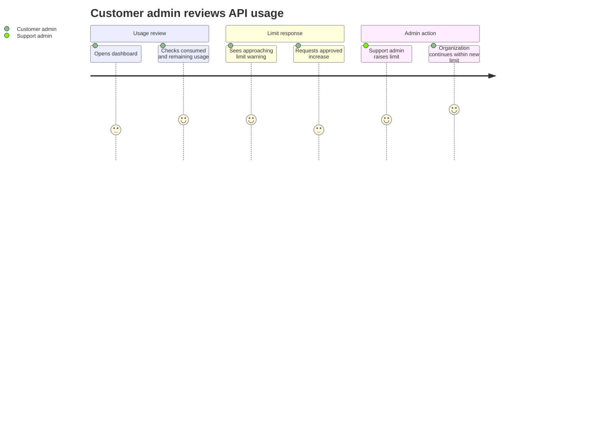
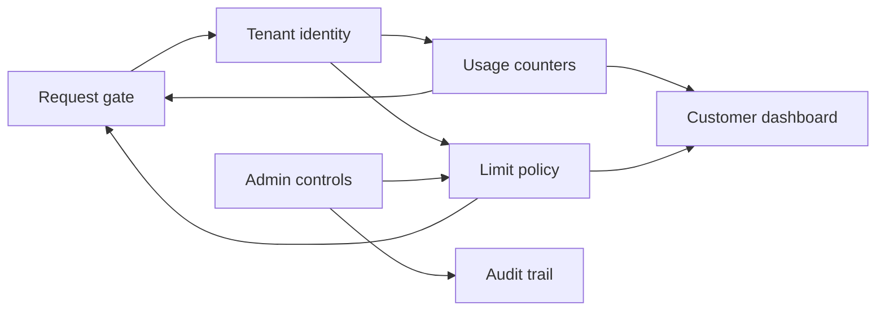
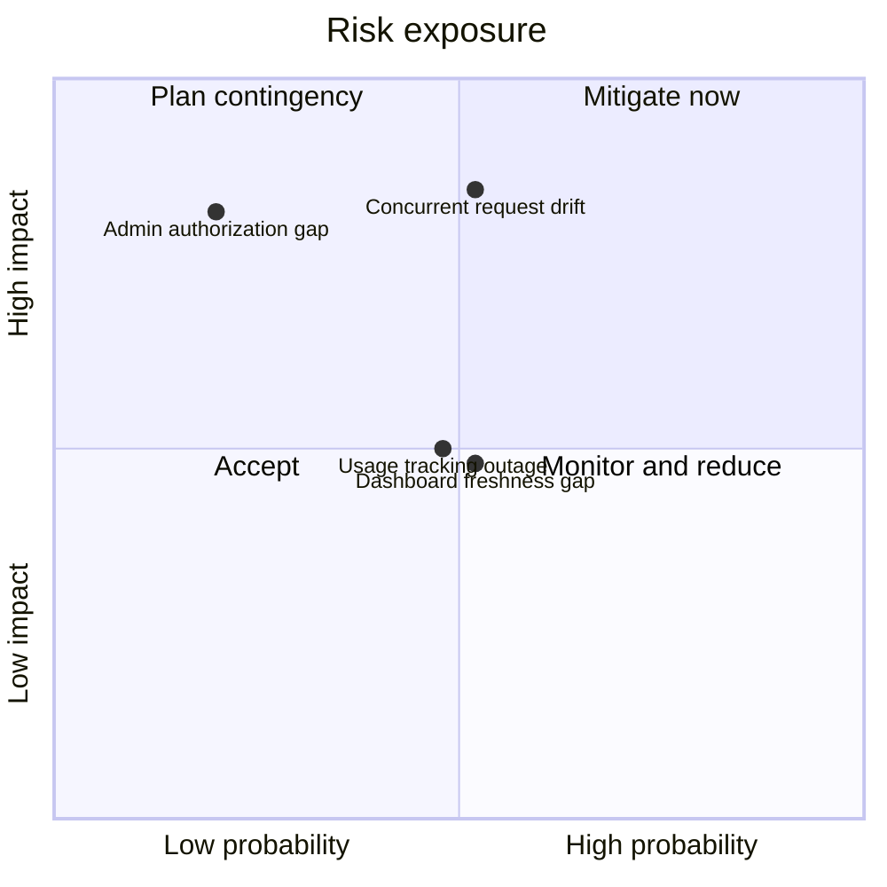

# Product Plan: Implementation Plan: Per-Tenant API (application programming interface) Rate Limiting

**Feature**: Implementation Plan: Per-Tenant API (application programming interface) Rate Limiting
**Source Plan**: [plan.md](../plan.md)
**Created**: 2026-05-30
**Status**: Draft

## Summary

This feature adds per-organization API limits for customer developers, customer admins, support admins, and operations leads. It protects shared service quality with separate short-window and monthly limits, gives clear retry guidance when a caller is over limit, shows customers their own usage, and lets authorized internal admins change approved limits without an engineering release.

## Feature Context

**Problem**: One organization's request volume can degrade service or exhaust usage without clear recovery.
**For**: Customer organizations, support admins, and operations teams.
**Change**: Each organization gets isolated limits, visible usage, and admin-managed adjustments.
**Quality bar**: Limits must stay accurate under peak concurrent traffic.
**Constraints**: The feature must preserve tenant isolation and avoid customer self-service increases.

## Goals

- Isolate each organization's request limits.
- Reject over-limit calls with clear retry guidance.
- Track monthly usage for each organization.
- Show current usage in the customer dashboard.
- Let admins change approved limits without releases.
- Audit every limit change.

## Out of Scope

- Customer self-service increases, to preserve plan control.
- Automatic overage billing, because usage hard-blocks.
- Tenant-specific billing cycles, because calendar months apply.
- Unauthenticated request counting, because authentication owns it.
- A new dashboard area, because existing views expand.

## Build Overview _(optional)_

The request entry point identifies the organization, checks the active limit policy, updates shared counters, and either accepts the request or returns clear retry guidance. Admin controls update the active policy and write an audit record, while the customer dashboard reads usage snapshots scoped to the viewing organization.

- **Request gate**: Enforces limits before accepted requests continue.
- **Tenant identity**: Maps each authenticated request to one organization.
- **Limit policy**: Stores default and tenant-specific limits.
- **Usage counters**: Track short-window and monthly consumption.
- **Admin controls**: Change approved limits and record audits.
- **Customer dashboard**: Shows scoped usage and limit status.

## Key Principles _(optional)_

- **Tenant isolation**: One organization never consumes another's limits.
- **Clear retry guidance**: Callers know which limit blocked them.
- **Atomic counters (all-or-nothing operation)**: Prevent counting drift.
- **Fail open**: Tracking outages preserve customer availability.
- **Admin-only changes**: Internal authorization protects paid limits.
- **Complete audit**: Every limit change remains traceable.

## Delivery Phases

### Phase 1: Burst Protection

- Enforce per-organization short-window limits.
- Return clear retry guidance for rejected calls.
- Keep other organizations unaffected by spikes.

### Phase 2: Monthly Quota

_Depends on_: Phase 1.

- Count accepted requests against monthly quota.
- Reject exhausted organizations until reset.
- Name the monthly quota as the binding limit.

### Phase 3: Admin Limit Management

_Depends on_: Phase 2.

- Let authorized admins change tenant limits.
- Apply new limits without an engineering release.
- Record old and new values for audits.

### Phase 4: Customer Usage Visibility

_Depends on_: Phase 2.

- Show consumed and remaining monthly usage.
- Show reset timing and burst limit.
- Warn customers near monthly quota.

## Key Decisions _(optional)_

### Shared Counter Enforcement

**Context**: Multiple request handlers must enforce the same organization limits under concurrency.
**Options considered**: Local counters, shared counters, or delayed batch accounting.
**Decision**: Use shared atomic counters for accepted request accounting.
**Consequence**: This supports accurate enforcement across replicas but depends on counter availability.

### Configurable Tenant Policies

**Context**: Admins must adjust approved tenant limits without releases.
**Options considered**: Static configuration, customer self-service, or admin-managed policy records.
**Decision**: Use admin-managed tenant policies with defaults for unset tenants.
**Consequence**: Support teams can resolve approved increases while customer self-service stays excluded.

### Availability During Tracking Outages

**Context**: The source assumptions require a documented failure mode for tracking outages.
**Options considered**: Fail open for availability or fail closed for protection.
**Decision**: Fail open and emit monitored alerts.
**Consequence**: Customers stay available, but temporary excess usage is possible.

### Existing Dashboard Extension

**Context**: The source assumes an existing tenant dashboard.
**Options considered**: Extend the existing dashboard or create a new surface.
**Decision**: Add usage visibility to the existing dashboard.
**Consequence**: Customers see limits where they already work, while new navigation stays out of scope.

## Risks and Mitigations _(optional)_

**Usage tracking outage**

- **What could go wrong**: Tracking outages may allow excess requests.
- **Probability**: Medium
- **Impact**: Medium
- **Mitigation**: Fail open with monitored alerts for operational response.

**Concurrent request drift**

- **What could go wrong**: Counts may understate or overstate accepted requests.
- **Probability**: Medium
- **Impact**: High
- **Mitigation**: Use atomic counter updates and concurrency validation.

**Admin authorization gap**

- **What could go wrong**: Limit changes may be blocked or exposed incorrectly.
- **Probability**: Low
- **Impact**: High
- **Mitigation**: Restrict changes to authorized internal admins.

**Dashboard freshness gap**

- **What could go wrong**: Stale usage may surprise customers at limits.
- **Probability**: Medium
- **Impact**: Medium
- **Mitigation**: Read recent usage snapshots and validate dashboard freshness.

## Divergences and Edge Cases _(optional)_

- **Missing tenant identity**: Existing authentication handles the request before rate limiting.
- **No tenant-specific policy**: Default limits apply until an admin changes them.
- **Boundary requests**: A consistent clock assigns each request to one window.
- **Limit lowered below usage**: The tenant remains over limit until reset.
- **Both limits exceeded**: The monthly quota is named as binding.

## Validation _(optional)_

- Over-limit burst calls receive retry guidance.
- Monthly exhausted calls receive retry guidance.
- One tenant cannot affect another tenant's limits.
- Admin changes affect later requests without releases.
- Dashboard usage matches actual consumption.
- Concurrent enforcement stays within the accuracy target.
- Every limit change appears in the audit trail.

## Open Questions _(optional)_

- Should future versions support tenant-specific billing cycles?
- Should paid overages replace hard blocking for some plans?
