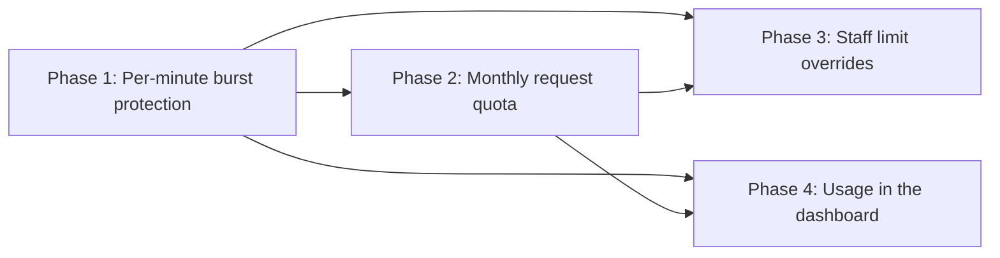

# Product Plan: Per-Tenant API Rate Limiting

**Feature**: Per-Tenant API Rate Limiting
**Source Plan**: [plan.md](../plan.md)
**Created**: 2026-05-31
**Status**: Draft

## Summary

This feature gives every customer organization its own limits on how often it can call the platform API (application programming interface): a cap per minute and a total per month. The work adds a single checkpoint that every authenticated request passes through, which identifies the organization and counts its requests against both limits. Over-limit requests are turned away with a clear response that names which limit was hit and when to retry. Internal staff can adjust an organization's limits on their own, every change is recorded, and customers see their current usage in the dashboard they already use.

## Goals and Non-Goals

**Goals**:

- Each organization is protected by its own per-minute and monthly limits.
- One organization's traffic never affects another's accepted requests.
- Over-limit callers get a clear response and a retry time.
- Staff raise an organization's limits without an engineering release.
- Every limit change is recorded with who, when, and values.
- Customers see current usage and an early warning in the dashboard.

**Non-goals**:

- Customers raising their own limits; only internal staff can.
- Overage beyond the monthly quota; organizations are blocked until reset.
- Counting unauthenticated requests; the existing login path handles them.
- Per-customer billing cycles; quotas reset on the calendar month.
- Building a new dashboard; usage is added to the existing one.

## Delivery Phases

### Phase 1: Per-minute burst protection

- Caps each organization's requests within any single minute.
- Rejects over-limit requests with a clear retry time.
- Keeps one organization's spike from affecting others.

### Phase 2: Monthly request quota

_Depends on_: Phase 1.

- Caps each organization's total requests per month.
- Resets the count at the start of each month.
- Rejects over-quota requests with the time until reset.

### Phase 3: Staff limit overrides

_Depends on_: Phase 1 and Phase 2.

- Lets internal staff raise an organization's limits.
- Applies changes without a release or restart.
- Records every change with actor, time, and values.

### Phase 4: Usage in the dashboard

_Depends on_: Phase 1 and Phase 2.

- Shows consumed, remaining, reset date, and burst limit.
- Warns when usage reaches 80% of the quota.
- Scopes the view to the viewer's own organization.

## Validation

- Over-limit callers get a response naming the limit and retry time.
- A limit change takes effect within one minute, no restart.
- Dashboard usage matches real consumption within one minute.
- Enforced counts stay within 1% of true counts under load.
- One organization's volume has no measurable effect on another's.
- Every limit change appears in the audit log fully detailed.
