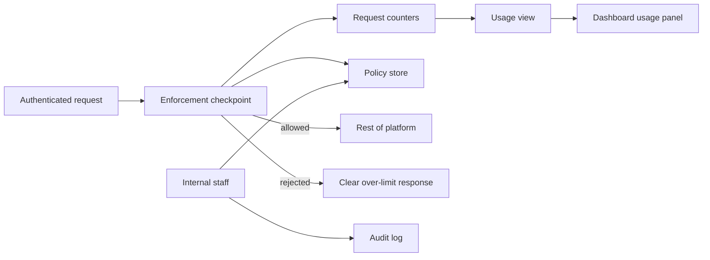
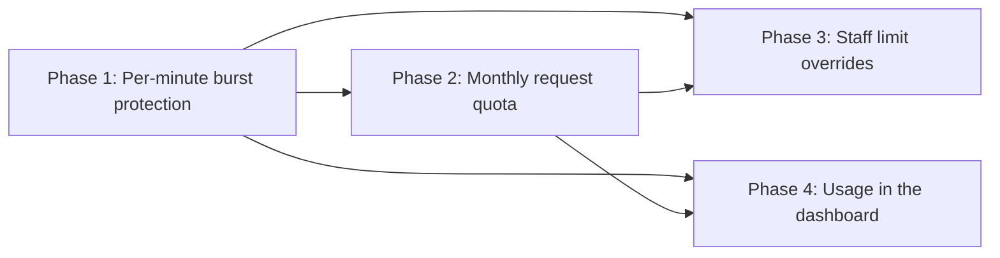

# Product Plan: Per-Tenant API Rate Limiting

**Feature**: Per-Tenant API Rate Limiting
**Source Plan**: [plan.md](../plan.md)
**Created**: 2026-05-31
**Status**: Draft

## Summary

This feature gives every customer organization its own limits on how often it can call the platform API (application programming interface): a cap per minute and a total per month. The work adds a single checkpoint that every authenticated request passes through, which identifies the organization and counts its requests against both limits. Over-limit requests are turned away with a clear response that names which limit was hit and when to retry. Internal staff can adjust an organization's limits on their own, every change is recorded, and customers see their current usage in the dashboard they already use.

**Problem**: One organization's request surge can slow the shared platform for every other customer.
**For**: Customer organizations that call the platform, and the internal staff who manage their limits.
**Change**: Each organization gets its own protected request capacity, visible usage, and staff-adjustable limits.
**Quality bar**: Limits are enforced accurately under heavy load, and usage and limit changes reflect within one minute.
**Constraints**: When the request-counting store is unavailable, the checkpoint allows requests (fails open) and raises a monitored alert.

## Goals and Non-Goals

**Goals**:

- Each organization is protected by its own per-minute and monthly limits.
- One organization's traffic never affects another's accepted requests.
- Over-limit callers get a clear response and a retry time.
- Staff raise an organization's limits without an engineering release.
- Every limit change is recorded with who, when, and values.
- Customers see current usage and an early warning in the dashboard.

**Non-goals**:

- Customers raising their own limits; only internal staff can.
- Overage beyond the monthly quota; organizations are blocked until reset.
- Counting unauthenticated requests; the existing login path handles them.
- Per-customer billing cycles; quotas reset on the calendar month.
- Building a new dashboard; usage is added to the existing one.

## Build Overview

Every authenticated request passes through one enforcement checkpoint before it reaches the rest of the platform. The checkpoint identifies the organization, then checks two request counters: one for the current minute and one for the current month. The limits it enforces come from a policy store that holds each organization's settings and sensible defaults, and that staff can update without a release. Each accepted request updates the counters, and each rejected one produces a clear response. A usage view reads the live counters so the dashboard can show consumption, and an audit log records every limit change.

- **Enforcement checkpoint**: Checks each request against both limits. This feature adds it.
- **Request counters**: Track per-minute and monthly use per organization. Feature adds them.
- **Policy store**: Holds each organization's limits and defaults. This feature adds it.
- **Usage view**: Reports live consumption to the dashboard. This feature adds it.
- **Audit log**: Records every limit change with detail. Feature adds it.
- **Dashboard usage panel**: Shows a customer their own usage. Feature adds it.

## Key Principles

- **Fail open**: If counting is down, allow requests and alert.
- **Accurate under load**: Enforced counts stay within 1% of true counts.
- **Additive, not new**: Usage joins the existing dashboard, not a new surface.
- **No restart to change limits**: Limit updates take effect without a release.

## Delivery Phases

### Phase 1: Per-minute burst protection

- Caps each organization's requests within any single minute.
- Rejects over-limit requests with a clear retry time.
- Keeps one organization's spike from affecting others.

### Phase 2: Monthly request quota

_Depends on_: Phase 1.

- Caps each organization's total requests per month.
- Resets the count at the start of each month.
- Rejects over-quota requests with the time until reset.

### Phase 3: Staff limit overrides

_Depends on_: Phase 1 and Phase 2.

- Lets internal staff raise an organization's limits.
- Applies changes without a release or restart.
- Records every change with actor, time, and values.

### Phase 4: Usage in the dashboard

_Depends on_: Phase 1 and Phase 2.

- Shows consumed, remaining, reset date, and burst limit.
- Warns when usage reaches 80% of the quota.
- Scopes the view to the viewer's own organization.

## Key Decisions

### Additive dashboard usage, not a new surface

**Context**: The platform already has a dashboard and a way to identify each organization.
**Options considered**: Build a new usage surface, or add usage to the existing dashboard.
**Decision**: Add a usage panel and a usage view to the existing dashboard.
**Consequence**: Smaller footprint and a familiar place for customers; tied to the current dashboard's shape.

### Fail open when request counting is unavailable

**Context**: The store that holds request counts could be temporarily unavailable.
**Options considered**: Allow requests during the outage (fail open), or block them (fail closed).
**Decision**: Allow requests and raise a monitored alert, favoring availability.
**Consequence**: Customers stay served during an outage; a spike could pass uncounted until it recovers.

## Risks and Mitigations

**Counting store outage**

- **What could go wrong**: An outage fails open and lets spikes through.
- **Probability**: Medium
- **Impact**: High
- **Mitigation**: A monitored alert lets staff respond fast.

**Counting drift under load**

- **What could go wrong**: Heavy load could push counts past the target.
- **Probability**: Low
- **Impact**: High
- **Mitigation**: Counting stays accurate under concurrency and is load-tested.

**Slow limit propagation**

- **What could go wrong**: A raised limit might miss the one-minute promise.
- **Probability**: Low
- **Impact**: Medium
- **Mitigation**: Cached limits refresh on change so updates apply fast.

**Stale usage view**

- **What could go wrong**: Usage could lag consumption and mislead a customer.
- **Probability**: Medium
- **Impact**: Low
- **Mitigation**: Usage stays fresh within one minute, with early warning.

## Validation

- Over-limit callers get a response naming the limit and retry time.
- A limit change takes effect within one minute, no restart.
- Dashboard usage matches real consumption within one minute.
- Enforced counts stay within 1% of true counts under load.
- One organization's volume has no measurable effect on another's.
- Every limit change appears in the audit log fully detailed.
