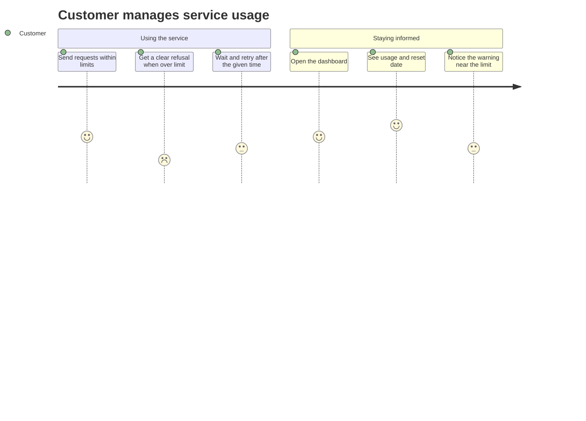
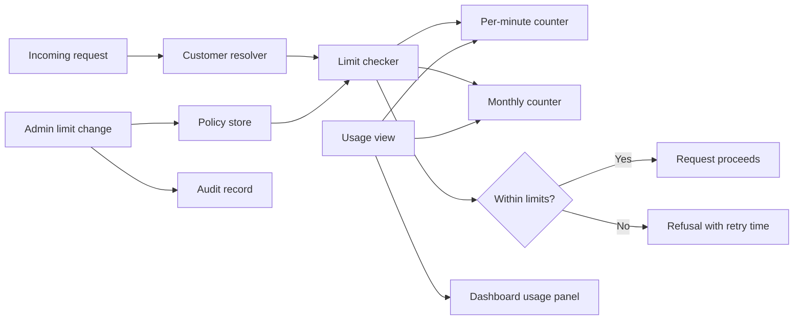
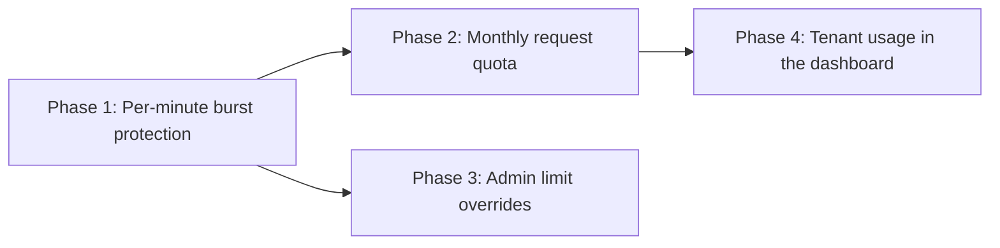
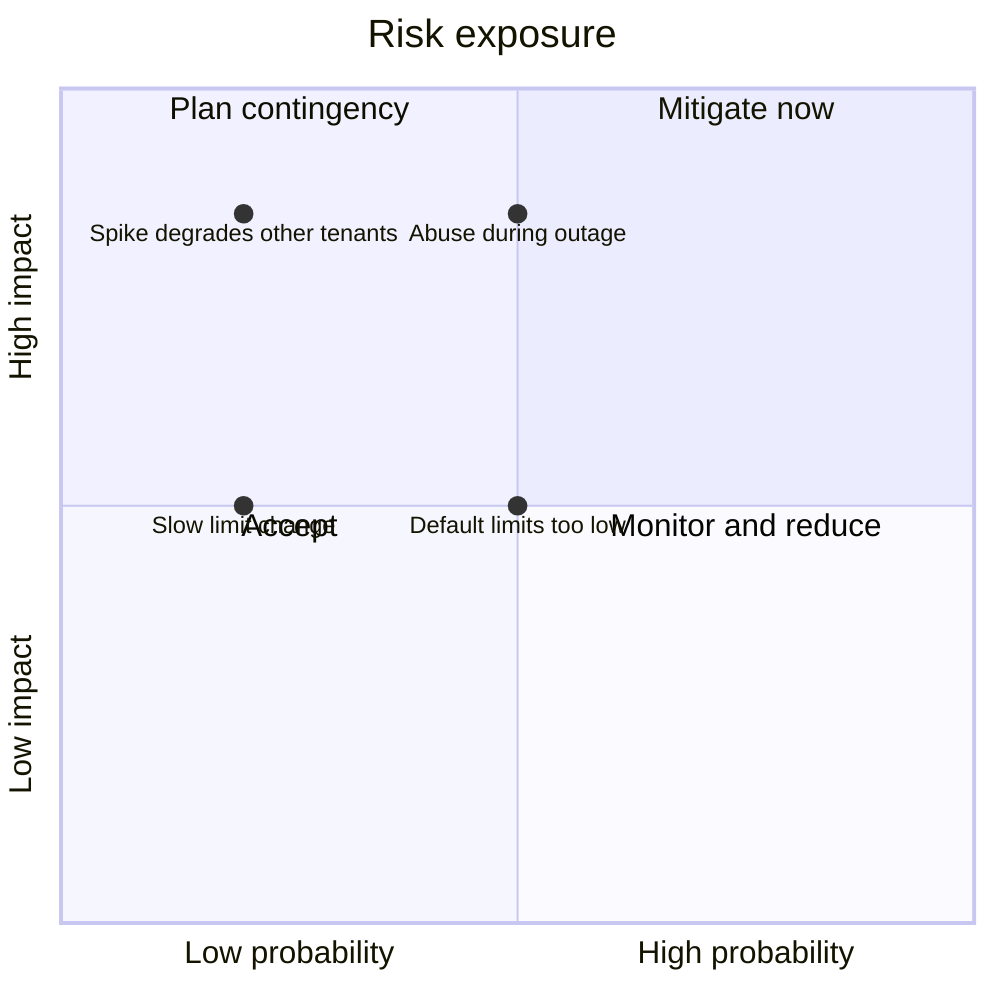

# Product Plan: Per-Tenant API Rate Limiting

**Feature**: Per-Tenant API Rate Limiting
**Source Plan**: [plan.md](../plan.md)
**Created**: 2026-05-30
**Status**: Draft

## Summary

This feature adds per-customer request limits to a shared service API (application programming interface, the way other software talks to our service). Each customer organization gets a per-minute burst limit and a monthly request quota. When a caller goes over a limit, the service refuses the request with a clear reason and a retry time. Customers see their own usage in the existing dashboard, and internal staff can raise a customer's limits on the spot, with every change recorded.

## Feature Context

**Problem**: One customer's traffic spike can degrade the shared service for everyone, with no fair per-customer boundary.
**For**: Customer organizations using the service, and the internal staff who support them.
**Change**: Each customer has its own enforced limits and visible usage, and staff adjust limits without a release.
**Quality bar**: Limits are enforced accurately under heavy concurrent load, with changes and usage reflected within one minute.
**Constraints**: Must not count or block unauthenticated requests, and must not require a deploy to change a limit.

## Goals

- Each customer's burst spikes are capped within the minute.
- Each customer's monthly quota is enforced and resets monthly.
- Over-limit callers get a clear refusal and retry time.
- Customers see their own usage and reset date.
- Staff raise a customer's limits without a release.
- Every limit change is recorded with who and when.

## Out of Scope

- Customers cannot self-serve limit changes, since that defeats plans.
- No paid overage beyond the quota in this version.
- Unauthenticated requests are not counted; authentication handles them.
- No new dashboard; usage joins the existing one.
- No per-customer billing cycle; months follow the UTC calendar.

## Build Overview

Enforcement happens at the front door of the service, before a request reaches the application. A check step identifies which customer the request belongs to, then consults two counters: one for the current minute and one for the current month. A policy store holds each customer's limits, with defaults for customers that have none, and is kept fresh so staff changes apply quickly. A separate usage view reads the live counters so the dashboard can show current consumption. Every limit change is written to a durable record.

- **Customer resolver**: Identifies the customer behind each request. Added here.
- **Limit checker**: Checks the per-minute and monthly counters. Added here.
- **Policy store**: Holds each customer's limits and defaults. Added here.
- **Usage view**: Reports current consumption to the dashboard. Added here.
- **Audit record**: Stores every limit change durably. Added here.
- **Dashboard usage panel**: Shows usage to the customer. Added here.

## Key Principles

- **Tenant isolation**: One customer's volume never affects another's limits.
- **Fail open**: If counters are unavailable, allow requests and alert.
- **No deploy for changes**: Limit changes apply without a release.
- **Accurate under load**: Counts stay near-exact even under heavy concurrency.

## Delivery Phases

### Phase 1: Per-minute burst protection

- Each customer's requests are capped within the current minute.
- Over-limit requests get a clear refusal with retry time.
- One customer's spike does not affect another customer.

### Phase 2: Monthly request quota

_Depends on_: Phase 1.

- Each customer's monthly usage is counted and capped.
- The quota resets at the start of each month.
- Refusals point to the next monthly reset when relevant.

### Phase 3: Admin limit overrides

_Depends on_: Phase 1.

- Staff can raise a customer's limits without a release.
- New limits take effect for later requests quickly.
- Every limit change is recorded with actor and values.

### Phase 4: Tenant usage in the dashboard

_Depends on_: Phase 2.

- Customers see consumed, remaining, reset date, and burst limit.
- The dashboard warns at 80% of the monthly quota.
- Each customer sees only its own organization's usage.

## Key Decisions

### Enforce at the front door

**Context**: Limits must apply to every authenticated request without changing each application path.
**Options considered**: Check inside each application handler, or check once at the service entry point.
**Decision**: Enforce once at the service entry point, before requests reach the application.
**Consequence**: One consistent choke point keeps application code unchanged, but the entry point must identify the customer.

### Two independent counters

**Context**: The feature needs both a short burst limit and a long monthly quota.
**Options considered**: A single combined counter, or separate per-minute and per-month counters.
**Decision**: Keep two independent counters, one per minute and one per calendar month in UTC.
**Consequence**: Each limit resets on its own schedule, and the refusal must name which limit was hit.

### Cache limits and refresh on change

**Context**: Limit changes must apply within a minute without a release, yet checks must stay fast.
**Options considered**: Read limits fresh on every request, or cache them and refresh on change.
**Decision**: Cache each customer's limits and refresh the cache when an admin changes them.
**Consequence**: Checks stay fast and changes apply quickly, but the cache must be invalidated reliably.

### Fail open when counters are unavailable

**Context**: The counter store could be briefly unavailable during a check.
**Options considered**: Block all requests (fail closed), or allow requests and alert (fail open).
**Decision**: Allow requests and raise a monitored alert when the counter store is unavailable.
**Consequence**: Availability is preserved during an outage, while protection is temporarily relaxed and watched.

## Risks and Mitigations

**Abuse slips through during an outage**

- **What could go wrong**: Fail-open lets abusive traffic through while counters are down.
- **Probability**: Medium
- **Impact**: High
- **Mitigation**: Alert on outages and keep them short.

**One tenant's spike degrades others**

- **What could go wrong**: A noisy tenant consumes shared capacity and slows others.
- **Probability**: Low
- **Impact**: High
- **Mitigation**: Isolate counts per tenant and load-test isolation.

**Default limits throttle legitimate traffic**

- **What could go wrong**: Default limits set too low block legitimate new customers.
- **Probability**: Medium
- **Impact**: Medium
- **Mitigation**: Set conservative defaults; staff override without a release.

**Support cannot raise a limit fast enough**

- **What could go wrong**: A customer stays stuck at a wrong limit until staff react.
- **Probability**: Low
- **Impact**: Medium
- **Mitigation**: Changes apply within a minute, with no release.

## Divergences and Edge Cases

- **Both limits hit**: The refusal names the monthly quota and longer wait.
- **Counter store down**: Requests are allowed and an alert is raised.
- **Window boundary**: Each request counts in exactly one time window.
- **No configured limit**: Default limits apply until staff set values.

## Validation

- Over-limit requests receive a refusal with a retry time.
- A customer's spike leaves other customers' rates unaffected.
- A raised limit governs the customer's requests within a minute.
- Dashboard usage matches actual consumption within a minute.
- Enforced counts stay within one percent under peak load.
- Every limit change appears in the audit record.
