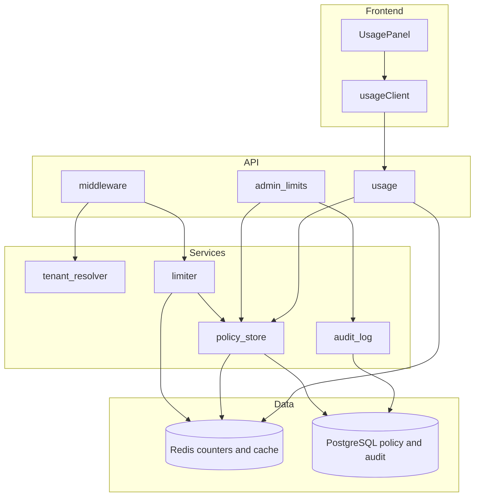
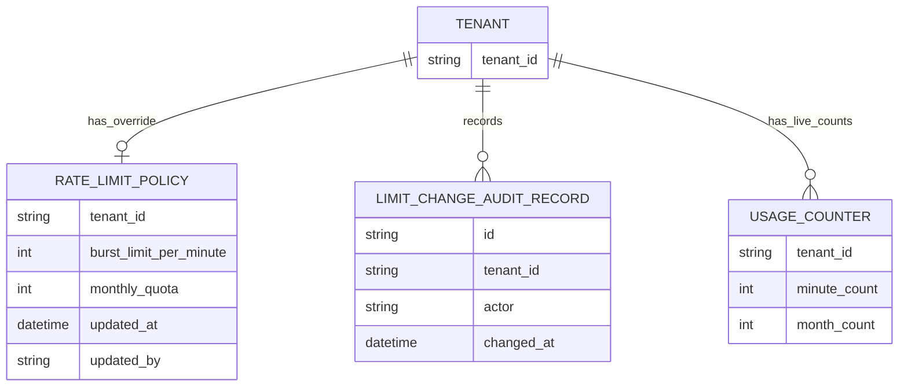
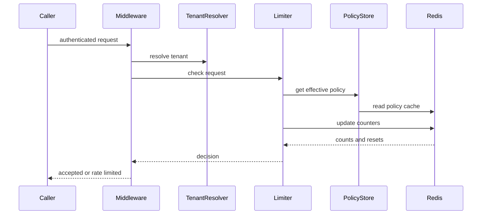
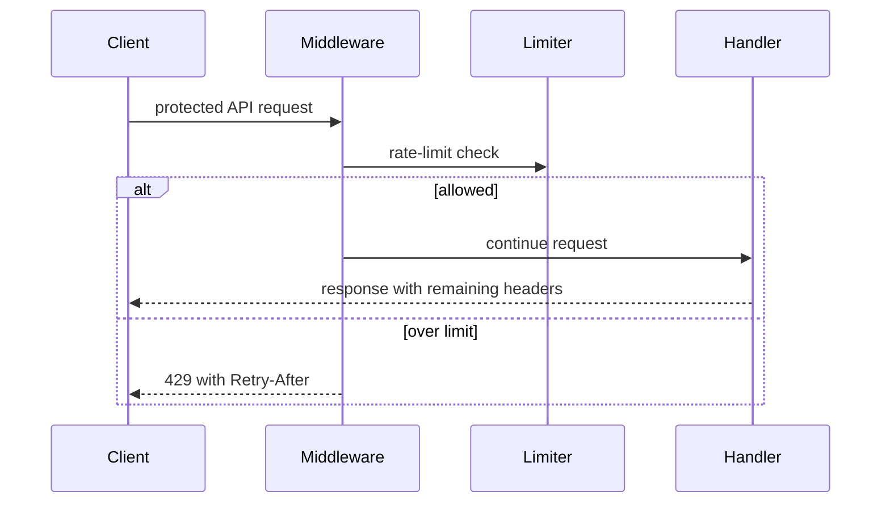
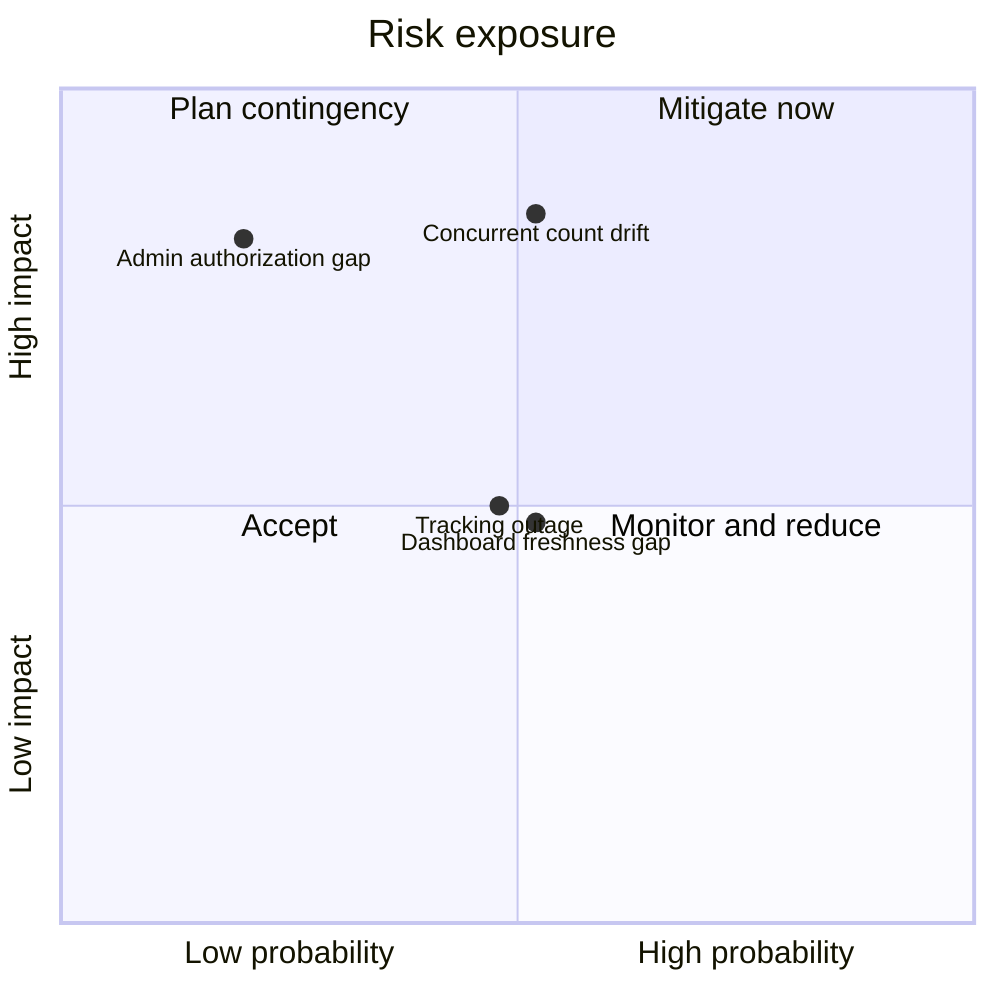

# Technical Design: Implementation Plan: Per-Tenant API Rate Limiting

**Feature**: Implementation Plan: Per-Tenant API Rate Limiting
**Created**: 2026-05-30
**Status**: Draft

## Summary

This design adds per-tenant API rate limiting across the backend API layer, data layer, and existing dashboard frontend. The API gateway middleware resolves the tenant, checks short-window and monthly counters, and returns a standardized 429 response when a limit blocks the request. Admin APIs update tenant policy rows and audit records, while the tenant usage API feeds the dashboard from live counters and effective policy values.

## Technical Context

**Current state**: The repository has a docs-only demo feature with assumed existing tenant identity, admin authorization, and dashboard surfaces.
**Affected layers**: backend API, backend services, data layer, cache layer, frontend dashboard, tests, observability
**Technical constraints**:

- Authenticated requests must resolve to exactly one tenant.
- Unauthenticated requests stay on the existing authentication path.
- Tenant usage must never expose another tenant's data.
- Admin limit changes require internal authorization.
- Tracking outages fail open and emit alerts.
- Monthly quotas align to UTC calendar months.

## Non-Functional Requirements

| Quality attribute (ISO 25010) | Target                                               | How verified                         |
| ----------------------------- | ---------------------------------------------------- | ------------------------------------ |
| Performance efficiency        | Rate-limit check adds < 5 ms p95 latency             | Backend integration and load tests   |
| Performance efficiency        | Sustain 5,000 requests/sec aggregate                 | Peak load test across tenants        |
| Functional suitability        | 100% of over-limit calls return 429 with Retry-After | Contract tests for limiter responses |
| Functional suitability        | New admin limits apply within 1 minute               | Admin update integration test        |
| Functional suitability        | Dashboard usage is fresh within 1 minute             | Dashboard E2E and usage API tests    |
| Reliability                   | Counts stay within 1% of accepted requests           | Concurrent request integration test  |
| Functional suitability        | 100% of limit changes have audit records             | Admin API contract tests             |

## Architectural Approach

The design fits a web application with a stateless backend, shared Redis counters, PostgreSQL policy storage, and an existing dashboard frontend. The API middleware is the enforcement boundary for authenticated traffic behind the limiter. It calls `tenant_resolver`, resolves the effective policy through `policy_store`, and delegates counter checks to `limiter`.

The limiter owns the decision path for burst limits, monthly quotas, and the binding-limit response. Accepted requests increment both counters. Rejected requests do not consume quota. When both limits are violated, the decision reports the monthly quota because it has the longer reset window.

Policy and audit data stay durable in PostgreSQL. Redis stores ephemeral usage counters and the effective-policy cache. Admin updates upsert the tenant policy, append a limit-change audit record in the same database transaction, and invalidate the cached policy so the next request can observe the new limit.

The dashboard reads usage through the tenant-scoped usage API. The endpoint derives the tenant from the authenticated principal and accepts no tenant identifier. This keeps dashboard reads scoped to the viewer's organization while still exposing consumed usage, remaining quota, reset time, burst limit, and approaching-limit status.



## Affected Modules

| Module / Component                        | Change | Responsibility                                    |
| ----------------------------------------- | ------ | ------------------------------------------------- |
| `backend/src/api/middleware.py`           | adds   | Enforces limits and builds 429 responses.         |
| `backend/src/api/admin_limits.py`         | adds   | Reads and updates tenant policies for admins.     |
| `backend/src/api/usage.py`                | adds   | Returns tenant-scoped usage snapshots.            |
| `backend/src/services/tenant_resolver.py` | uses   | Maps authenticated requests to tenant ids.        |
| `backend/src/services/limiter.py`         | adds   | Checks counters and returns rate-limit decisions. |
| `backend/src/services/policy_store.py`    | adds   | Resolves defaults, overrides, and policy cache.   |
| `backend/src/services/audit_log.py`       | adds   | Appends immutable limit-change records.           |
| `backend/src/models/rate_limit_policy.py` | adds   | Represents tenant policy overrides.               |
| `backend/src/models/usage.py`             | adds   | Shapes usage snapshots over live counters.        |
| `backend/src/models/audit.py`             | adds   | Represents limit-change audit records.            |
| `frontend/src/components/UsagePanel.tsx`  | adds   | Displays usage, reset, and warning state.         |
| `frontend/src/services/usageClient.ts`    | adds   | Calls the tenant usage API.                       |

## Data Design

### Data Model

```text
Tenant
- tenant_id: UUID or string, stable organization identity.
```

```text
RateLimitPolicy
- tenant_id: tenant reference, unique policy owner.
- burst_limit_per_minute: integer, positive burst cap.
- monthly_quota: integer, positive monthly cap.
- updated_at: timestamp, UTC policy update time.
- updated_by: actor reference, last admin modifier.
```

```text
UsageCounter
- minute key: integer, accepted requests this minute.
- month key: integer, accepted requests this UTC month.
- quota_resets_at: timestamp, next UTC month boundary.
- burst_limit_per_minute: integer, effective burst cap.
```

```text
LimitChangeAuditRecord
- id: UUID, audit record identity.
- tenant_id: tenant reference, affected organization.
- actor: actor reference, admin who changed limits.
- changed_at: timestamp, server-assigned UTC time.
- old_burst_limit: integer or null, previous burst cap.
- new_burst_limit: integer, new burst cap.
- old_monthly_quota: integer or null, previous quota.
- new_monthly_quota: integer, new quota.
```

```text
RateLimitDecision
- allowed: boolean, request proceeds when true.
- binding_limit: none, burst, or monthly.
- retry_after_seconds: integer or null, retry delay.
- limit_value: integer, limit that blocked the request.
- window_resets_at: timestamp, binding reset time.
```



### Data Flow

An authenticated request enters the middleware, resolves its tenant, reads the effective policy, and updates live counters if the request is accepted. Admin writes update the policy and audit row together, then invalidate the policy cache. Dashboard reads combine live monthly counters with the effective policy to produce the usage snapshot.



## API Design

The feature adds one tenant usage read, one internal admin policy read and write surface, and a standardized limiter response envelope on protected routes. Request and response bodies stay conceptual here; the contract files remain the detailed source for field rules and contract tests.

```text
GET /usage
  Request: authenticated tenant user, no tenant id parameter.
  Response: tenant_id, monthly_quota, consumed_this_month, remaining_this_month,
            quota_resets_at, burst_limit_per_minute, approaching_limit, as_of.
  Errors: authentication failure follows the existing auth path.
```

```text
GET /admin/tenants/{tenant_id}/limits
  Request: admin role and tenant_id path parameter.
  Response: tenant_id, burst_limit_per_minute, monthly_quota,
            source, updated_at, updated_by.
  Errors: 403 for non-admin, 404 for unknown tenant.
```

```text
PUT /admin/tenants/{tenant_id}/limits
  Request: admin role, burst_limit_per_minute, monthly_quota.
  Response: updated tenant policy.
  Errors: 400 for invalid limits, 403 for non-admin, 404 for unknown tenant.
```

```text
Protected API route
  Request: authenticated request behind the limiter.
  Response: normal handler response with rate-limit headers.
  Errors: 429 with Retry-After, binding_limit, limit, retry_after_seconds, resets_at.
```



## Spec Coverage

| Use Case (from spec.md)                     | Component / Operation          | Notes                                        |
| ------------------------------------------- | ------------------------------ | -------------------------------------------- |
| US1 AS1.1 Burst limit accepts N requests    | `limiter` and middleware       | Counter allows requests within limit.        |
| US1 AS1.2 Burst overage returns 429         | 429 response envelope          | Retry-After uses minute reset.               |
| US1 AS1.3 Other tenants unaffected          | `tenant_resolver` and counters | Tenant id scopes all keys.                   |
| US1 AS1.4 Next window restores access       | `limiter` minute counter       | Minute reset enables new requests.           |
| US2 AS2.1 Monthly usage decreases remaining | `limiter` month counter        | Accepted requests increment quota usage.     |
| US2 AS2.2 Monthly overage returns 429       | 429 response envelope          | Retry-After uses monthly reset.              |
| US2 AS2.3 New month resets quota            | Usage counter monthly key      | UTC month boundary resets usage.             |
| US2 AS2.4 Both limits exceeded              | `RateLimitDecision`            | Monthly quota becomes binding limit.         |
| US3 AS3.1 Admin raises burst limit          | Admin limits API               | Cache invalidation applies new policy.       |
| US3 AS3.2 Admin raises monthly quota        | Admin limits API               | Usage reflects increased remaining quota.    |
| US3 AS3.3 Audit saved                       | `audit_log`                    | Audit row records actor and values.          |
| US3 AS3.4 Non-admin denied                  | Admin limits API               | 403 prevents changes and audits.             |
| US4 AS4.1 Dashboard shows monthly usage     | Usage API and UsagePanel       | Shows quota, consumed, remaining, reset.     |
| US4 AS4.2 Dashboard shows burst limit       | Usage API and UsagePanel       | Effective burst limit is included.           |
| US4 AS4.3 Approaching warning appears       | Usage API and UsagePanel       | Warning starts at 80% consumption.           |
| US4 AS4.4 Tenant scoping holds              | Usage API                      | Tenant derives from authenticated principal. |

## Key Technical Decisions

### API Middleware Enforcement

**Context**: Every authenticated protected route must share the same limiting behavior.
**Options considered**:

- Route handlers: simple, but easy to miss.
- API middleware: centralizes enforcement before handlers.

**Decision**: Enforce in API gateway middleware.
**Consequences**:

- Positive: Protected routes get consistent 429 behavior.
- Negative: Middleware needs careful ordering with authentication.

### Shared Atomic Counters

**Context**: Horizontally scaled replicas must count accepted requests consistently.
**Options considered**:

- Local counters: low latency, but unsafe across replicas.
- Shared counters: consistent, but depend on Redis availability.
- Batch accounting: cheaper, but fails immediate enforcement.

**Decision**: Use Redis atomic counters for burst and monthly usage.
**Consequences**:

- Positive: Counters stay consistent across stateless replicas.
- Negative: Fail-open behavior can allow temporary excess usage.

### Durable Policy and Audit Storage

**Context**: Tenant limits and audit history must survive restarts.
**Options considered**:

- Configuration only: simple, but requires releases.
- Durable policy rows: dynamic and auditable.

**Decision**: Store policies and audit records in PostgreSQL.
**Consequences**:

- Positive: Admin changes become durable and traceable.
- Negative: Policy writes require transactional care.

### Effective Policy Cache

**Context**: Limit checks need current policies without adding excess latency.
**Options considered**:

- Read durable storage every request: current, but slower.
- Cache effective policy: faster, but needs invalidation.

**Decision**: Cache effective policies and invalidate on admin change.
**Consequences**:

- Positive: Request checks stay within latency targets.
- Negative: Cache invalidation becomes part of correctness.

## Testing Strategy

- **Unit**: Limiter math, window resets, and retry selection.
- **Integration**: Tenant isolation, concurrency, admin changes, audit writes.
- **E2E / BDD**: Burst, quota, admin, and dashboard scenarios.
- **Observability**: Track fail-open alerts and rate-limit decisions.

## Rollout and Migration

**Strategy**: Not specified in source.
**Data migration**: Add tenant policy and audit storage for overrides.
**Rollback**: Not specified in source.

## Risks and Mitigations

**Tracking outage**

- **What could go wrong**: Fail-open mode may allow excess usage.
- **Probability**: Medium
- **Impact**: Medium
- **Mitigation**: Emit monitored alerts when counters are unavailable.

**Concurrent count drift**

- **What could go wrong**: Accepted counts may diverge under load.
- **Probability**: Medium
- **Impact**: High
- **Mitigation**: Use atomic counters and concurrency tests.

**Admin authorization gap**

- **What could go wrong**: Wrong users may change tenant limits.
- **Probability**: Low
- **Impact**: High
- **Mitigation**: Require internal admin authorization for writes.

**Dashboard freshness gap**

- **What could go wrong**: Customers may see stale usage data.
- **Probability**: Medium
- **Impact**: Medium
- **Mitigation**: Verify usage freshness through E2E tests.



## Open Questions

- Should future versions support tenant-specific billing cycles?
