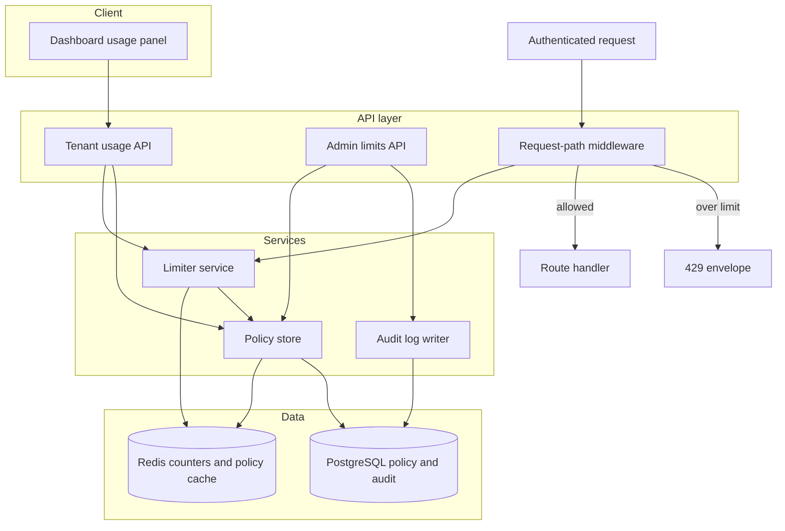
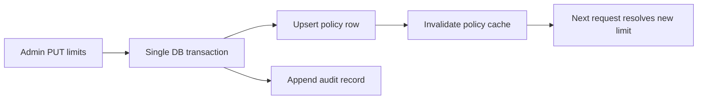
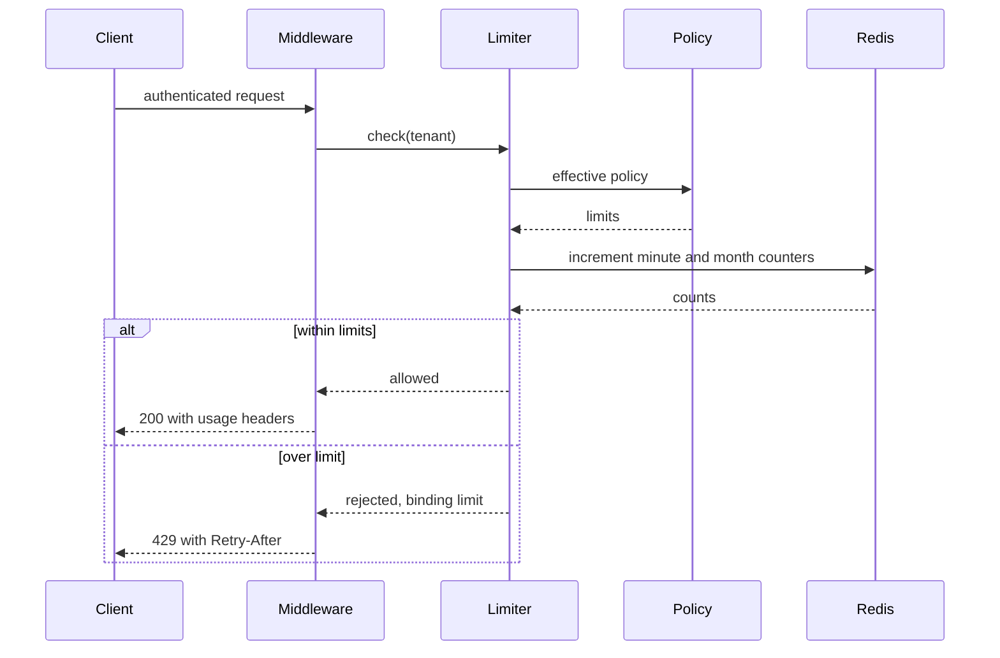

# Technical Design: Per-Tenant API Rate Limiting

**Feature**: Per-Tenant API Rate Limiting
**Created**: 2026-05-31
**Status**: Draft

## Summary

This feature enforces two independent per-tenant limits, a per-minute burst limit and a monthly quota, at a single enforcement point in the API request path. A new limiter service checks two atomic counters in Redis, resolves each tenant's effective policy from PostgreSQL (cached in Redis and invalidated on change), and records every limit change in an append-only audit table. An admin API reads and updates a tenant's policy without a deploy, and a tenant-scoped usage API powers a new usage panel in the existing dashboard.

**Current state**: The platform authenticates API requests and has an existing dashboard and tenant identity, but applies no per-tenant request limits.
**Affected layers**: API layer (request-path middleware), domain services, data layer (Redis, PostgreSQL), existing frontend dashboard.
**Constraints**:

- Counters must be atomic under high concurrency.
- Limit changes must apply without a deploy or restart.
- When the counter store is unavailable, the gateway fails open.
- The usage API must never expose another tenant's data.
- Audit rows are append-only, written with the policy change.

## Non-Functional Requirements

| Quality attribute (ISO 25010) | Target                                                       | How verified              |
| ----------------------------- | ------------------------------------------------------------ | ------------------------- |
| Performance efficiency        | Rate-limit check adds under 5 ms p95 per request             | Load test at peak traffic |
| Performance efficiency        | Sustains 5,000 requests per second aggregate across replicas | Load test                 |
| Functional suitability        | Enforced counts within 1% of true accepted counts            | Concurrency test suite    |
| Performance efficiency        | Admin limit change effective within 1 minute, no restart     | Integration test          |
| Performance efficiency        | Dashboard usage fresh within 1 minute of real usage          | Usage freshness test      |

## Architectural Approach

The design adds a single enforcement point to the existing API layer: a request-path middleware that runs before every authenticated route handler. The middleware resolves the tenant from the authenticated principal, asks the limiter service for a decision, and either lets the request through or returns a 429 envelope. Route handlers themselves are untouched, so enforcement is uniform and additive.

The limiter service checks two atomic counters in Redis: a fixed-window per-minute key with a 60-second time-to-live, and a monthly key bound to the UTC calendar month. Atomic increment operations keep counts accurate under concurrent load across stateless API replicas that share one Redis. Only accepted requests increment the counters, so a rejected request consumes no quota.

Effective policy resolution is owned by a policy store service. It reads a tenant's RateLimitPolicy row from PostgreSQL, falls back to platform defaults when no row exists, and caches the result in Redis. The admin API updates the row, appends an audit record in the same database transaction, and invalidates the policy cache so the next request resolves the new value within the one-minute target, with no deploy or restart.

Usage visibility is read-only. A tenant-scoped usage API derives consumed, remaining, reset date, and burst limit from the live counters and effective policy, and never accepts a tenant id from the caller, so a user can only read their own organization. The existing dashboard gains an additive usage panel that calls this endpoint. The key design principles are: enforce once at the edge, keep counters atomic and ephemeral, resolve policy through a cache that invalidates on change, and extend the existing dashboard rather than build a new surface.



## Affected Modules

| Module / Component               | Change | Responsibility                                                           |
| -------------------------------- | ------ | ------------------------------------------------------------------------ |
| Request-path middleware (API)    | adds   | Enforces limits on every authenticated request; builds the 429 envelope. |
| Tenant resolver                  | adds   | Maps an authenticated request to its tenant id.                          |
| Limiter service                  | adds   | Checks atomic burst and monthly counters; computes the decision.         |
| Policy store service             | adds   | Resolves effective policy with defaults; caches and invalidates.         |
| Audit log writer                 | adds   | Appends an immutable record for every limit change.                      |
| Admin limits API                 | adds   | Reads and updates a tenant's policy, admin only.                         |
| Tenant usage API                 | adds   | Returns the caller's own usage for the dashboard.                        |
| Dashboard usage panel (frontend) | adds   | Shows consumed, remaining, reset date, burst limit.                      |
| Policy and audit tables          | adds   | Durable policy override and append-only change history.                  |
| Existing dashboard               | uses   | Hosts the new usage panel.                                               |

## Data Design

### Data Model

```text
RateLimitPolicy (PostgreSQL)
- tenant_id: FK to Tenant - primary key, one row per override
- burst_limit_per_minute: integer - > 0, requests per minute window
- monthly_quota: integer - > 0, accepted requests per UTC month
- updated_at: timestamptz - UTC, set on every change
- updated_by: actor ref - last admin to change
Absence of a row means platform defaults apply.
```

```text
LimitChangeAuditRecord (PostgreSQL, append-only)
- id: UUID - primary key
- tenant_id: FK to Tenant - affected tenant
- actor: actor ref - admin who made the change
- changed_at: timestamptz - UTC, server-assigned
- old_burst_limit / new_burst_limit: integer - previous and new
- old_monthly_quota / new_monthly_quota: integer - previous and new
Written in the same transaction as the policy change.
```

```text
UsageCounter (Redis, ephemeral)
- rl:{tenant_id}:min:{yyyymmddhhmm}: accepted count this minute, 60s TTL
- rl:{tenant_id}:mon:{yyyymm}: accepted count this UTC month, rolls monthly
Only accepted requests increment counters.
```

```text
RateLimitDecision (transient, per request)
- allowed: boolean
- binding_limit: enum {none, burst, monthly}
- retry_after_seconds: integer or null - longer wait when both hit
- limit_value: integer - the limit that was hit
- window_resets_at: timestamptz - minute or month boundary
```

### Data Flow

An inbound request enters the middleware, which resolves the tenant and calls the limiter. The limiter reads the effective policy (cache first, PostgreSQL on a miss) and atomically increments the minute and month counters. An accepted request proceeds; an over-limit request is rejected before the handler runs and consumes no quota. An admin update follows a separate write path: it writes the policy row and the audit record in one transaction, then invalidates the policy cache so the next request resolves the new limit.



## API Design

```text
(every authenticated route, applied by the middleware)
  Accepted response headers:
    X-RateLimit-Limit-Minute, X-RateLimit-Remaining-Minute
    X-RateLimit-Limit-Month, X-RateLimit-Remaining-Month
  Rejected (over limit):
    Status: 429 Too Many Requests
    Header: Retry-After: <seconds> (longer wait when both limits hit)
    Body:   error, message, binding_limit (burst|monthly), limit,
            retry_after_seconds, resets_at
```

```text
GET /admin/tenants/{tenant_id}/limits   (admin only)
  Response: tenant_id, burst_limit_per_minute, monthly_quota,
            source (override|default), updated_at, updated_by
  Errors:   403 non-admin

PUT /admin/tenants/{tenant_id}/limits   (admin only)
  Request:  burst_limit_per_minute, monthly_quota (positive integers)
  Response: updated policy (same shape as GET)
  Effects:  upsert policy + append audit (one transaction) + invalidate cache
  Errors:   400 invalid values; 403 non-admin; 404 unknown tenant
```

```text
GET /usage   (any authenticated tenant user; tenant from principal, no id in path)
  Response: tenant_id, monthly_quota, consumed_this_month,
            remaining_this_month, quota_resets_at, burst_limit_per_minute,
            approaching_limit (true past warn threshold), as_of (fresh within 1 min)
  Isolation: no parameter can name another tenant
```



## Spec Coverage

| Use Case (from spec.md)                     | Component / Operation                 | Notes                                        |
| ------------------------------------------- | ------------------------------------- | -------------------------------------------- |
| US1 per-minute burst protection (AS1.1-1.4) | Limiter service, minute counter       | 429 with Retry-After up to 60 seconds        |
| US2 monthly request quota (AS2.1-2.4)       | Limiter service, month counter        | binding_limit monthly; longer wait wins      |
| US3 admin raises a limit (AS3.1-3.4)        | Admin limits API, policy store, audit | effective within 1 minute; 403 for non-admin |
| US4 tenant sees usage (AS4.1-4.4)           | Tenant usage API, usage panel         | tenant-scoped; approaching_limit warning     |
| Tenant isolation (FR-011)                   | Per-tenant counter keys               | one tenant's volume cannot affect another    |
| Cross-tenant usage isolation (FR-020)       | Usage API, no tenant id in path       | resolved from principal only                 |
| Concurrency accuracy (SC-006, FR-022)       | Atomic Redis increments               | within 1% under peak load                    |
| Fail-open on counter outage (Edge Case)     | Middleware fail-open path, alert      | requests allowed, outage monitored           |

## Key Technical Decisions

### Fixed-window per-minute counters

**Context**: Counts must stay accurate under high concurrency at peak load.
**Options considered**:

- Fixed-window atomic counters with a short expiry.
- Sliding-window request log per tenant.
- Relational counters updated per request.

**Decision**: Use fixed-window atomic counters in the in-memory store.
**Consequences**:

- Positive: Simple, fast, and atomic under concurrency.
- Negative: Allows a brief burst across window boundaries.

### Fail open when the counter store is unavailable

**Context**: The in-memory counter store could be temporarily unavailable.
**Options considered**:

- Fail open: allow requests, preserve availability.
- Fail closed: block requests, preserve protection.

**Decision**: Fail open and raise a monitored alert.
**Consequences**:

- Positive: Customer availability is preserved during an outage.
- Negative: A spike could pass uncounted until recovery.

### Additive usage in the existing dashboard

**Context**: A dashboard and tenant identity already exist to build on.
**Options considered**:

- Add a usage panel to the existing dashboard.
- Build a new standalone usage surface.

**Decision**: Add a usage panel and a tenant usage endpoint.
**Consequences**:

- Positive: Smaller footprint, familiar place for customers.
- Negative: Tied to the existing dashboard's shape.

## Testing Strategy

- **Unit**: Limiter math, window boundaries, Retry-After selection, policy defaulting.
- **Integration**: Per-tenant isolation, window resets, concurrency, cache invalidation on change.
- **E2E / BDD**: Usage panel reflects traffic; tenant scoping; admin raise effect.
- **Observability**: Rejection rate, fail-open events, counter-store health, change-propagation latency.

## Rollout and Migration

**Strategy**: Enable enforcement for all tenants using generous platform defaults, then tune per tenant through the admin API; monitor rejection and fail-open rates during the ramp.
**Data migration**: Add the policy and audit tables; no backfill is needed, since an absent row means defaults apply, and counters rebuild from live traffic.
**Rollback**: Disable the enforcement middleware so all requests pass through; the policy and audit tables can remain, and counters expire on their own.

## Risks and Mitigations

**Counter store outage**

- **What could go wrong**: An outage fails open and lets spikes through.
- **Probability**: Medium
- **Impact**: High
- **Mitigation**: Monitored alert; revisit fail-closed if protection must win.

**Counting drift under load**

- **What could go wrong**: Heavy concurrency could push counts past the target.
- **Probability**: Low
- **Impact**: High
- **Mitigation**: Atomic increments and a concurrency test suite guard accuracy.

**Cache invalidation lag**

- **What could go wrong**: Stale cached policy could miss the one-minute target.
- **Probability**: Low
- **Impact**: Medium
- **Mitigation**: Invalidate the cache inside the write transaction.

**Stale usage view**

- **What could go wrong**: Usage could lag consumption and mislead a customer.
- **Probability**: Medium
- **Impact**: Low
- **Mitigation**: Usage stays fresh within one minute, with early warning.
