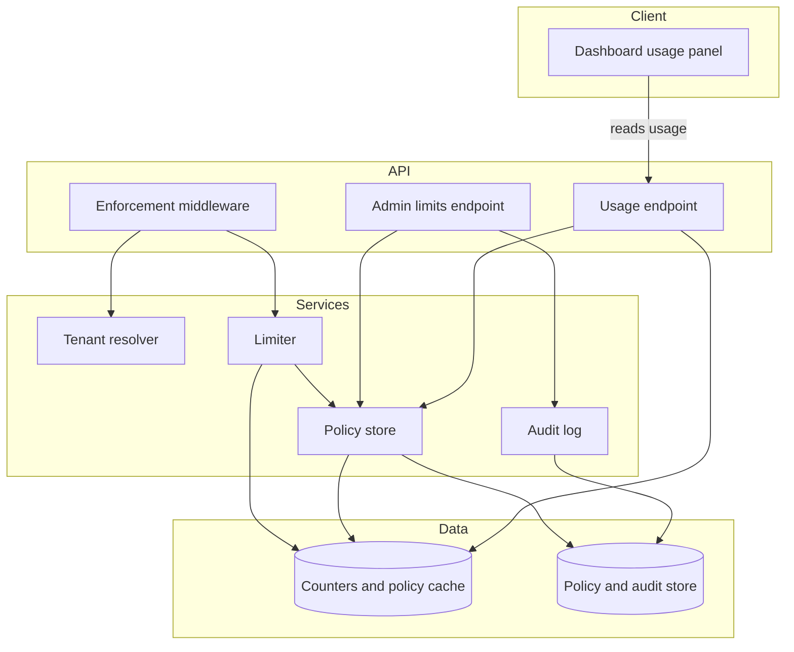
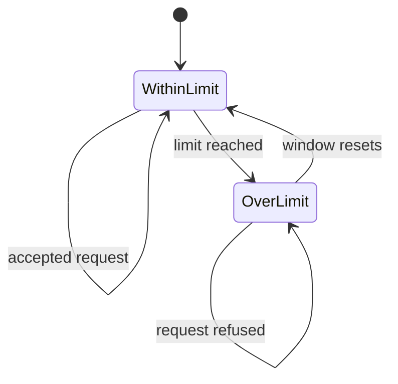
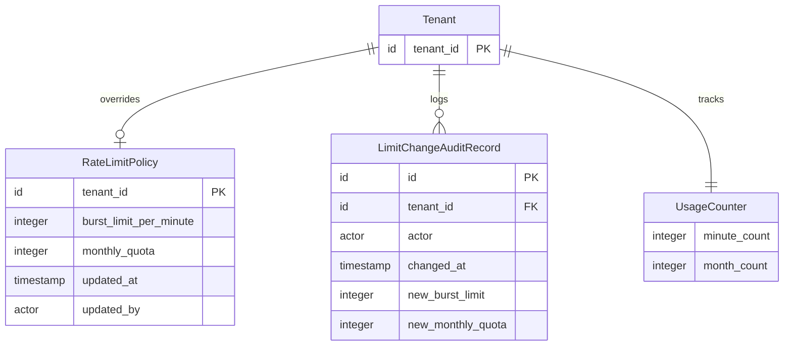
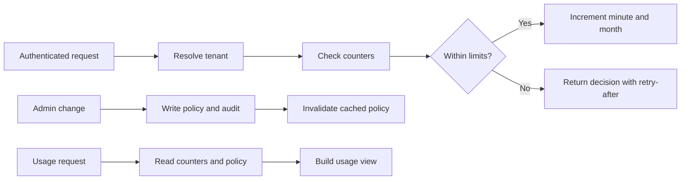
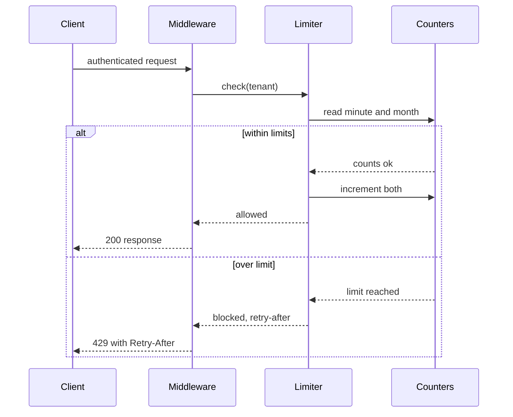

# Technical Design: Per-Tenant API Rate Limiting

**Feature**: Per-Tenant API Rate Limiting
**Created**: 2026-05-30
**Status**: Draft

## Summary

This feature enforces two independent per-tenant rate limits, a per-minute burst limit and a monthly quota, at an API gateway middleware that runs after authentication and before application handlers. The middleware resolves the tenant from the authenticated request, then checks two atomic counters held in a fast in-memory store (Redis). Durable policy overrides and an immutable audit trail live in the relational store (PostgreSQL), with the effective policy cached and invalidated on admin change. The dashboard gains a usage panel backed by a tenant-scoped usage endpoint that reads the live counters.

## Technical Context

**Current state**: An existing authenticated API and tenant identity serve customers through a dashboard, with no per-tenant rate limiting today.
**Affected layers**: API gateway middleware, backend services, data layer (counter store and relational store), dashboard frontend.
**Technical constraints**:

- Counters must be atomic to stay within 1% accuracy under concurrency.
- Admin limit changes must take effect within one minute.
- Dashboard usage must be fresh within one minute.
- Counter-store outage fails open and emits a monitored alert.
- Rate-limit check adds under 5 ms at p95 latency.

## Architectural Approach

The core of the design is an enforcement middleware placed at the front of the request pipeline, after authentication and before application handlers. It resolves the tenant from the authenticated request through a tenant resolver, then asks the limiter for a decision. Because it sits at a single choke point, no individual application handler needs to know about rate limiting.

The limiter checks two independent counters in the in-memory store: a fixed-window per-minute key that expires after 60 seconds, and a monthly key tied to the UTC calendar month. Each accepted request increments both counters atomically, so counts stay accurate under high concurrency. The limiter produces a transient RateLimitDecision that names whether the request is allowed, which limit is binding, and the retry-after wait. Only accepted requests increment counters; an over-limit request consumes nothing.

The policy store resolves the effective policy for a tenant: a per-tenant override row when present, otherwise platform defaults held in configuration. The effective policy is cached in the in-memory store and invalidated whenever an admin changes a limit, so changes take effect within the one-minute target without a restart.

The admin limits endpoint lets authorized admins read and update a tenant's policy. Every change is written append-only to the audit trail in the same transaction as the policy update, so a policy change can never exist without its audit record. Unauthorized callers are denied before any change is made.

A tenant-scoped usage endpoint aggregates the live counters and effective policy into a usage view: consumed this month, remaining, reset date, and burst limit. The dashboard adds a usage panel that reads this endpoint and shows an approaching-limit warning at 80% of the monthly quota. Tenant scoping ensures a user sees only their own organization's usage.

The key design principles are a single enforcement choke point, two independent reset cycles, atomic counter updates for accuracy, cache-and-invalidate for limits that are both fast and current, and fail-open on a counter-store outage to preserve availability.



A tenant's limit window moves through a small lifecycle: it accepts requests until the limit is reached, refuses further requests until the window resets, then accepts again.



## Affected Modules

| Module / Component        | Change | Responsibility                                          |
| ------------------------- | ------ | ------------------------------------------------------- |
| Tenant resolver           | adds   | Maps an authenticated request to its tenant id.         |
| Enforcement middleware    | adds   | Runs the limit check and builds the 429 envelope.       |
| Limiter                   | adds   | Checks atomic burst and monthly counters per request.   |
| Policy store              | adds   | Resolves effective policy with defaults and a cache.    |
| Audit log                 | adds   | Writes append-only records of every limit change.       |
| Admin limits endpoint     | adds   | Lets authorized admins read and update a tenant policy. |
| Usage endpoint            | adds   | Returns tenant-scoped usage for the dashboard.          |
| Dashboard usage panel     | adds   | Shows consumption, reset date, and a limit warning.     |
| Counters and policy cache | uses   | Holds atomic counters and the cached effective policy.  |
| Policy and audit store    | uses   | Persists policy overrides and the audit trail.          |

## Data Design

### Data Model

```text
RateLimitPolicy (durable, relational; absent row means platform defaults)
- tenant_id: id - primary key, one row per tenant override
- burst_limit_per_minute: integer - greater than 0, requests per minute window
- monthly_quota: integer - greater than 0, accepted requests per UTC month
- updated_at: timestamp - UTC, set on every change
- updated_by: actor reference - last admin to change

LimitChangeAuditRecord (durable, append-only)
- id: id - primary key
- tenant_id: id - affected tenant
- actor: actor reference - admin who made the change
- changed_at: timestamp - UTC, server-assigned
- old_burst_limit / new_burst_limit: integer - previous and new values
- old_monthly_quota / new_monthly_quota: integer - previous and new values

UsageCounter (ephemeral, in-memory; reconstructable from traffic)
- minute key: accepted count in the active minute, expires after 60 seconds
- month key: accepted count in the active UTC month, rolls at month boundary

RateLimitDecision (transient, per request, not stored)
- allowed: boolean - whether the request proceeds
- binding_limit: none | burst | monthly - which limit blocked it
- retry_after_seconds: integer - longer wait when both limits are hit
- limit_value: integer - the limit that was hit
- window_resets_at: timestamp - minute or month boundary
```



### Data Flow

A request enters the middleware, which resolves the tenant and asks the limiter to check the counters. On an accepted request, both the minute and month counters increment atomically; on an over-limit request, neither increments and a decision carrying a retry-after value is returned. Admin changes write the policy override and an audit record in one transaction, then invalidate the cached policy. The usage endpoint reads the live counters and effective policy to build the usage view.



## API Design

The feature touches three surfaces: the rate-limited response envelope, an admin limits surface, and a tenant usage surface. Shapes are conceptual, not a full specification.

```text
Rate-limited response (applies to any limited endpoint)
  Response (429 Too Many Requests):
    Retry-After: seconds to wait
    body: { reason, binding_limit: burst | monthly, limit_value, resets_at }
  Behavior: the longer wait wins when both limits are hit

GET /admin/tenants/{tenant_id}/limits        (admin only)
  Response: { burst_limit_per_minute, monthly_quota, updated_at, updated_by }
  Errors:   403 when the caller is not an authorized admin

PUT /admin/tenants/{tenant_id}/limits        (admin only)
  Request:  { burst_limit_per_minute?, monthly_quota? }
  Response: { burst_limit_per_minute, monthly_quota, updated_at }
  Errors:   403 not authorized; 400 non-positive value
  Effect:   writes an audit record, invalidates the cache, effective within one minute

GET /tenants/{tenant_id}/usage               (tenant-scoped)
  Response: { consumed_this_month, remaining_this_month, monthly_quota,
              quota_resets_at, burst_limit_per_minute }
  Errors:   403 when requesting another tenant's usage
```



## Spec Coverage

| Use Case (from spec.md)           | Component / Operation                | Notes                          |
| --------------------------------- | ------------------------------------ | ------------------------------ |
| US1 burst limit enforced          | Limiter, minute counter              | Atomic per-minute window       |
| US1 isolation between tenants     | Per-tenant counter keys              | Per-tenant key namespace       |
| US1 burst window reset            | Minute key 60s expiry                | FR-009                         |
| US2 monthly quota enforced        | Limiter, month counter               | UTC month key                  |
| US2 monthly reset                 | Month key rolls at boundary          | FR-010                         |
| US2 binding limit named           | RateLimitDecision                    | FR-007, FR-008                 |
| US3 admin raises limit, no deploy | Admin limits endpoint, cache refresh | Effective within one minute    |
| US3 change audited                | Audit log                            | Same transaction as the policy |
| US3 non-admin denied              | Admin authorization                  | FR-016                         |
| US4 dashboard shows usage         | Usage endpoint, usage panel          | Consumed, remaining, reset     |
| US4 approaching-limit warning     | Usage panel                          | 80% threshold                  |
| US4 tenant scoping                | Usage endpoint scoping               | FR-020                         |

## Key Technical Decisions

### Enforce at gateway middleware

**Context**: Limits must apply to every authenticated request without per-handler changes.
**Options considered**:

- In-handler checks: precise but duplicated across every endpoint.
- Single middleware choke point: one place, but resolves tenant itself.

**Decision**: Enforce once at an API gateway middleware before application handlers.
**Consequences**:

- Positive: One consistent enforcement point; handlers stay unchanged.
- Negative: The middleware must resolve tenant and own all limit logic.

### Two independent fixed-window counters

**Context**: The feature needs a short burst window and a long monthly window.
**Options considered**:

- Single combined counter: simpler but cannot reset on two cycles.
- Sliding window: smoother but heavier per-request cost.
- Two fixed windows: simple and cheap, with sharp boundaries.

**Decision**: Use two independent fixed-window counters, per-minute and per-UTC-month.
**Consequences**:

- Positive: Cheap atomic operations; each limit resets independently.
- Negative: Fixed windows allow bursts at window edges.

### Cache effective policy, invalidate on change

**Context**: Changes must apply within a minute without a restart, yet checks must stay fast.
**Options considered**:

- Read policy every request: always fresh but slower per request.
- Cache with timed expiry: fast but changes lag the expiry.
- Cache with invalidation on write: fast and prompt.

**Decision**: Cache the effective policy and invalidate it on every admin write.
**Consequences**:

- Positive: Fast checks and prompt limit changes without a restart.
- Negative: Cache invalidation must be reliable to avoid stale limits.

### Fail open on counter-store outage

**Context**: The counter store may be briefly unavailable during a check.
**Options considered**:

- Fail closed: blocks all traffic, maximizing protection.
- Fail open: allows traffic, maximizing availability.

**Decision**: Fail open and emit a monitored alert when the counter store is unavailable.
**Consequences**:

- Positive: Customer availability is preserved during a counter-store outage.
- Negative: Protection is temporarily relaxed, relying on alerting.

## Testing Strategy

- **Unit**: Limiter math, window-boundary handling, retry-after selection logic.
- **Integration**: Per-tenant isolation, window resets, concurrent counting accuracy.
- **E2E / BDD**: US1 burst, US2 quota, US3 admin override, US4 dashboard usage.
- **Observability**: Counter-store outage alerts, fail-open events, enforced-count accuracy.

## Rollout and Migration

**Strategy**: Gradual rollout by phase (burst, then monthly, then admin override, then dashboard), with platform default limits applied to every tenant.
**Data migration**: None required; policy overrides are created on demand and counters are reconstructable from traffic.
**Rollback**: Disable enforcement at the middleware so all requests pass; durable policy and audit rows remain intact.

## Risks and Mitigations

**Counter store outage during checks**

- **What could go wrong**: Fail-open lets traffic through unprotected during an outage.
- **Probability**: Medium
- **Impact**: High
- **Mitigation**: Monitored alerts and short outage windows.

**Inaccurate counts under concurrency**

- **What could go wrong**: Non-atomic updates miscount, breaking the 1% accuracy target.
- **Probability**: Medium
- **Impact**: High
- **Mitigation**: Atomic counter operations plus concurrency load tests.

**Stale cached policy after a change**

- **What could go wrong**: Failed invalidation keeps an old limit in effect.
- **Probability**: Low
- **Impact**: Medium
- **Mitigation**: Invalidate on write and bound cache lifetime.

**Window-edge burst doubling**

- **What could go wrong**: Fixed windows allow a double burst at boundaries.
- **Probability**: Low
- **Impact**: Medium
- **Mitigation**: Accept per spec, or revisit with a sliding window later.
