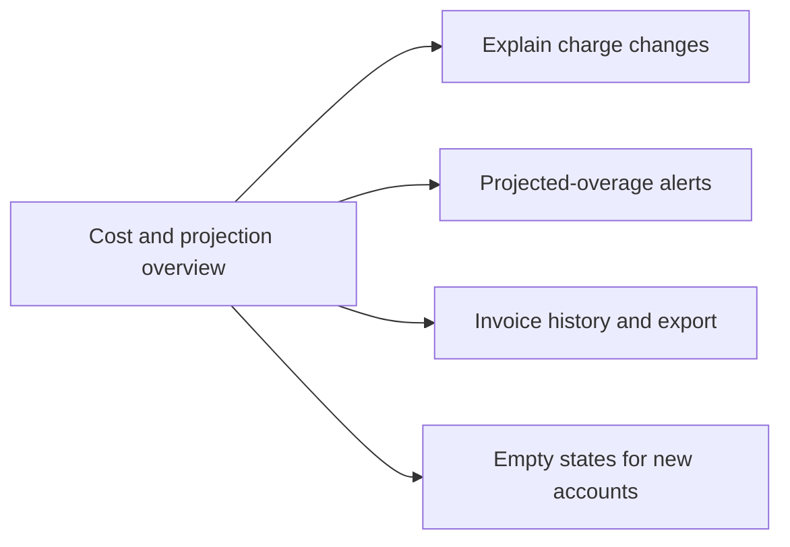

# Product Plan: Self-Serve Billing Usage Dashboard

**Feature**: Self-Serve Billing Usage Dashboard
**Source Plan**: [plan.md](../plan.md)
**Created**: 2026-05-31
**Status**: Draft

## Summary

This builds a read-only billing dashboard for organization admins, so they can answer "what will this cost me, and why?" without contacting support. It shows the current plan and included allowances, usage so far this period, and a projected end-of-period total that separates the included plan price from any projected overage. It explains changes by breaking usage down per team and comparing the current period to the previous one, and it can warn admins before an overage is invoiced. The approach reads usage from an existing metering source and stores plans, invoices, alert rules, and cached projections, computing the account total and per-team usage in one pass so the numbers always reconcile.

## Goals and Non-Goals

**Goals**:

- Admins see plan, usage, and a projected bill at a glance.
- Projected overage is shown separately from the included plan price.
- Per-team and unattributed usage reconcile to the account total.
- Admins are alerted before an overage reaches the invoice.
- Past invoices can be reviewed and exported for finance.
- Every panel shows a purposeful empty state for new accounts.

**Non-goals**:

- Changing plans, payments, or disputes, the dashboard is read-only.
- Creating or managing teams, consumed as existing data.
- Forecasting beyond a simple run-rate projection, deferred.
- Alert channels beyond email and in-app, deferred.
- Owning usage data, read from an existing metering source.
- Historical backfill of usage or invoices, not included.

## Delivery Phases

### Phase 1: Cost and projection overview

- Show plan, allowances, and usage per dimension.
- Project the end-of-period bill with overage split.
- Surface when usage data is stale or unavailable.

### Phase 2: Explain charge changes

_Depends on_: Phase 1.

- Break usage down per team and unattributed.
- Compare the current period against the previous one.
- Surface the largest drivers of any change.

### Phase 3: Projected-overage alerts

_Depends on_: Phase 1.

- Let admins enable and configure overage alerts.
- Fire alerts before the invoice, without duplicates.
- Record alert activity for the admin to review.

### Phase 4: Invoice history and export

_Depends on_: Phase 1.

- List past invoices with totals and status.
- Open line-item detail for any invoice.
- Export invoice data for finance.

### Phase 5: Empty states for new accounts

_Depends on_: Phase 1.

- Show purposeful empty states on every panel.
- Explain what appears once usage begins.
- Never show a blank or error panel.

## Divergences and Edge Cases

- **Mid-period plan change**: usage and projection reflect the new plan, not mixed.
- **Stale usage data**: the dashboard flags staleness instead of projecting confidently.
- **Unattributed usage**: shown in a labeled bucket that still reconciles.
- **Access revoked**: billing data stays restricted to admin and billing roles.

## Validation

- Per-team plus unattributed usage equals the account total.
- A new account shows purposeful empty states on every panel.
- Overage alerts arrive before the period's invoice is issued.
- A threshold alert fires at most once per period.
- The projected total separates included price from overage.
- Stale usage is shown as stale, not as confident.
