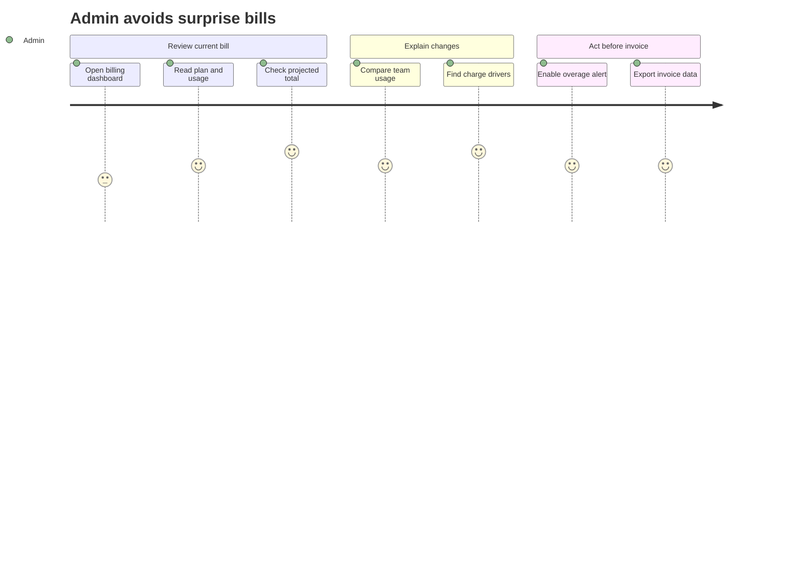
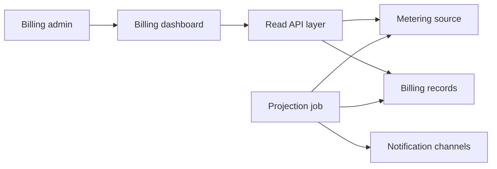
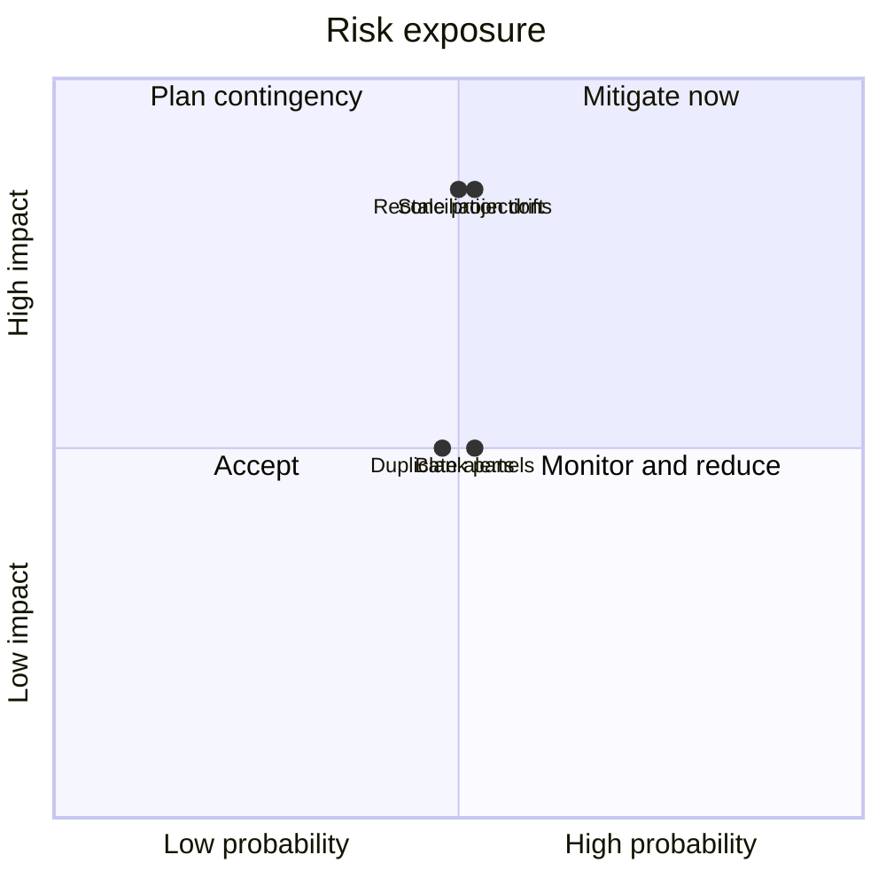

# Product Plan: Implementation Plan: Self-Serve Billing Usage Dashboard

**Feature**: Implementation Plan: Self-Serve Billing Usage Dashboard
**Source Plan**: [plan.md](../plan.md)
**Created**: 2026-05-30
**Status**: Draft

## Summary

This feature gives organization admins a read-only billing dashboard that shows the current plan, current-period usage, projected overage, invoice history, team-level usage, and alert activity. The main approach adds a dashboard, a read API (application programming interface) layer, a projection and alert job, and shared billing records that keep usage, projections, invoices, and alerts consistent.

## Feature Context

**Problem**: Admins cannot self-serve answers about projected bills, charge changes, or past invoices.
**For**: Organization admins and billing-role users who manage account spend.
**Change**: They can review costs, explain changes, export invoices, and enable alerts.
**Quality bar**: Totals reconcile exactly and every dashboard panel has a purposeful state.
**Constraints**: The dashboard must not change plans, payments, disputes, metering, or teams.

## Goals

- Show current plan and allowance usage.
- Separate included price from projected overage.
- Explain charge changes by team and dimension.
- Send one alert per threshold and period.
- Export invoice data for finance review.
- Show helpful empty states for new accounts.

## Out of Scope

- Plan changes, existing billing flow remains.
- Payments and disputes, existing flows remain.
- Team management, teams already exist.
- Advanced forecasting, run-rate projection only.
- Extra alert channels, first version excludes them.
- Spend caps, no automated throttling.

## Build Overview

The dashboard presents billing information to admins and requests read-only billing views from the API layer. That layer combines plan, invoice, alert, and projection records with the existing metering source. A separate projection and alert job refreshes estimates, checks alert rules, records sent alerts, and notifies admins before invoices are issued.

- **Billing dashboard**: Shows costs, usage, alerts, invoices, and empty states.
- **Read API layer**: Serves dashboard views and invoice export.
- **Metering source**: Supplies current usage and freshness signals.
- **Billing records**: Store plans, invoices, alerts, and cached projections.
- **Projection job**: Recomputes estimates and evaluates alert rules.
- **Notification channels**: Deliver email and in-app alerts.

## Key Principles

- **Read-only billing**: Admins view data, but billing changes stay elsewhere.
- **Exact reconciliation**: Team usage plus unattributed usage matches totals.
- **Alert dedupe**: Each threshold fires once per billing period.
- **Freshness clarity**: Stale or unavailable projections are clearly labeled.
- **Purposeful empties**: New accounts see guidance, not blank panels.
- **Single currency**: All money uses the account billing currency.

## Delivery Phases

### Phase 0: Research choices

- Choose the demo technology stack.
- Document rationale for major defaults.
- Align with the sibling example baseline.

### Phase 1: Design contracts

_Depends on_: Phase 0.

- Define billing data entities.
- Define read surfaces and invoice export.
- Capture dashboard validation checks.

### Phase 2: Implementation tasks

_Depends on_: Phase 1.

- Convert design into ordered work.
- Cover tests for each user story.
- Keep billing changes out of scope.

## Key Decisions

### Add a read-oriented billing surface

**Context**: The feature must explain billing without owning metering or changing billing.
**Options considered**: Own billing data, change billing flows, or add read views.
**Decision**: Add read views, a dashboard, and one projection job.
**Consequence**: This enables self-service insight while keeping billing writes elsewhere.

### Compute totals from one aggregation pass

**Context**: Team usage and account totals must reconcile exactly.
**Options considered**: Separate queries, cached team totals, or one shared pass.
**Decision**: Compute account, team, and unattributed usage together.
**Consequence**: This protects trust but ties breakdown freshness to aggregation.

## Risks and Mitigations

**Reconciliation drift**

- **What could go wrong**: Parts stop matching totals.
- **Probability**: Medium
- **Impact**: High
- **Mitigation**: Compute totals from one aggregation pass.

**Duplicate alerts**

- **What could go wrong**: Admins receive repeated threshold notices.
- **Probability**: Medium
- **Impact**: Medium
- **Mitigation**: Dedupe against the alert event log.

**Stale projections**

- **What could go wrong**: Admins trust outdated projections.
- **Probability**: Medium
- **Impact**: High
- **Mitigation**: Surface freshness and unavailable data.

**Blank new-account panels**

- **What could go wrong**: New accounts see blank panels.
- **Probability**: Medium
- **Impact**: Medium
- **Mitigation**: Drive empty states from responses.

## Divergences and Edge Cases

- **Mid-period plan change**: Projection reflects the changed allowance.
- **Little early usage**: Projection explains its limited basis.
- **Renamed or deleted team**: History still represents prior usage.
- **Unusual invoice state**: History shows pending, failed, or refunded status.
- **Multiple overage dimensions**: Summary separates each exceeded dimension.
- **Large team count**: Breakdown remains readable through grouping.
- **Revoked access**: Billing data is no longer shown.
- **Delayed metering**: Dashboard shows stale or unavailable usage.

## Validation

- Admin sees projected bill without support.
- Projected overage is distinct from plan price.
- Per-team usage reconciles exactly.
- Alerts arrive before invoice issuance.
- Duplicate threshold alerts are suppressed.
- Invoice data exports for finance review.
- Empty panels show purposeful guidance.
