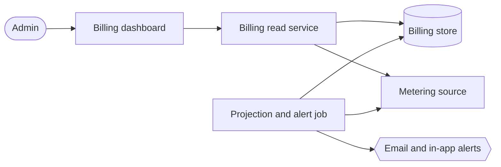
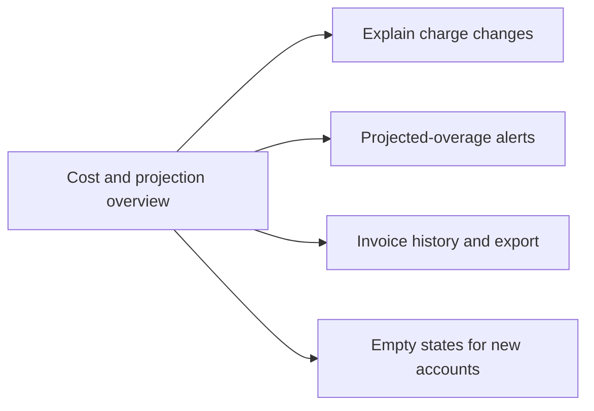

# Product Plan: Self-Serve Billing Usage Dashboard

**Feature**: Self-Serve Billing Usage Dashboard
**Source Plan**: [plan.md](../plan.md)
**Created**: 2026-05-31
**Status**: Draft

## Summary

This builds a read-only billing dashboard for organization admins, so they can answer "what will this cost me, and why?" without contacting support. It shows the current plan and included allowances, usage so far this period, and a projected end-of-period total that separates the included plan price from any projected overage. It explains changes by breaking usage down per team and comparing the current period to the previous one, and it can warn admins before an overage is invoiced. The approach reads usage from an existing metering source and stores plans, invoices, alert rules, and cached projections, computing the account total and per-team usage in one pass so the numbers always reconcile.

**Problem**: Admins cannot tell what they will owe until the invoice arrives, which causes surprise charges and support contacts.
**For**: Organization admins and billing owners responsible for the account's spend.
**Change**: They can see a projected bill and its drivers at any time, and be warned before an overage.
**Quality bar**: Panels read quickly enough to grasp the projected bill in seconds, never show a blank or error panel, and per-team usage reconciles exactly to the account total.
**Constraints**: The dashboard is read-only over billing (no plan changes, payments, or disputes), and overage alerts must reach admins before the invoice is issued.

## Goals and Non-Goals

**Goals**:

- Admins see plan, usage, and a projected bill at a glance.
- Projected overage is shown separately from the included plan price.
- Per-team and unattributed usage reconcile to the account total.
- Admins are alerted before an overage reaches the invoice.
- Past invoices can be reviewed and exported for finance.
- Every panel shows a purposeful empty state for new accounts.

**Non-goals**:

- Changing plans, payments, or disputes, the dashboard is read-only.
- Creating or managing teams, consumed as existing data.
- Forecasting beyond a simple run-rate projection, deferred.
- Alert channels beyond email and in-app, deferred.
- Owning usage data, read from an existing metering source.
- Historical backfill of usage or invoices, not included.

## Build Overview

The dashboard reads from a small set of parts that keep billing records in one place and usage in another. A read-only billing service answers the dashboard's requests by combining stored billing records with live usage pulled from an existing metering source. A durable store holds plans, invoices, alert rules, the log of alerts already sent, and cached projections. A scheduled job recomputes the projection and fires overage alerts before each invoice is issued. The dashboard itself is one screen of panels that reads from the billing service and never writes back to billing.

- **Billing dashboard**: panels admins read; this feature adds it.
- **Billing read service**: answers dashboard requests; this feature adds it.
- **Billing store**: holds plans, invoices, alerts, and projections; feature adds it.
- **Metering source**: existing usage system; this feature only reads it.
- **Projection and alert job**: recomputes projections, sends alerts; feature adds it.

## Key Principles

- **Reconciliation**: per-team plus unattributed always equals the account total.
- **Alert before close**: alerts fire before each invoice is issued.
- **No duplicate alerts**: a threshold fires at most once per period.
- **Read-only billing**: never change plans, payments, or disputes.
- **Always a purposeful state**: never show a blank or error panel.
- **Honest about staleness**: flag stale or unavailable data clearly.

## Delivery Phases

### Phase 1: Cost and projection overview

- Show plan, allowances, and usage per dimension.
- Project the end-of-period bill with overage split.
- Surface when usage data is stale or unavailable.

### Phase 2: Explain charge changes

_Depends on_: Phase 1.

- Break usage down per team and unattributed.
- Compare the current period against the previous one.
- Surface the largest drivers of any change.

### Phase 3: Projected-overage alerts

_Depends on_: Phase 1.

- Let admins enable and configure overage alerts.
- Fire alerts before the invoice, without duplicates.
- Record alert activity for the admin to review.

### Phase 4: Invoice history and export

_Depends on_: Phase 1.

- List past invoices with totals and status.
- Open line-item detail for any invoice.
- Export invoice data for finance.

### Phase 5: Empty states for new accounts

_Depends on_: Phase 1.

- Show purposeful empty states on every panel.
- Explain what appears once usage begins.
- Never show a blank or error panel.

## Key Decisions

### Read-only and additive, not owning billing data

**Context**: Plans, teams, invoices, and usage already exist in upstream systems.
**Options considered**: Own a new billing data model, or read additively from the existing systems.
**Decision**: Add read access and one dashboard surface; do not own billing or write to it.
**Consequence**: This lowers risk and avoids new write paths, but the dashboard depends on upstream data quality.

### One aggregation pass for reconciliation

**Context**: Per-team and unattributed usage must reconcile exactly to the account total.
**Options considered**: Compute the total and the per-team breakdown separately, or in a single pass.
**Decision**: Compute the account total and per-team breakdown in one pass over the same source.
**Consequence**: This guarantees reconciliation, at the cost of materializing the current period's breakdown.

### A scheduled job for alerts before invoicing

**Context**: Overage alerts must reach admins before the invoice is issued.
**Options considered**: Recompute on each dashboard view, or run a scheduled projection-and-alert job.
**Decision**: Run a scheduled job that recomputes projections and fires alerts ahead of billing close.
**Consequence**: Alerts arrive on time and at most once, but this adds one non-request component to operate.

## Risks and Mitigations

**Stale upstream usage**

- **What could go wrong**: stale or missing usage data produces misleading projections.
- **Probability**: Medium
- **Impact**: High
- **Mitigation**: flag stale or unavailable data instead of projecting confidently.

**Inaccurate early projections**

- **What could go wrong**: early run-rate projections overstate cost, triggering false alarms.
- **Probability**: Medium
- **Impact**: Medium
- **Mitigation**: show the projection basis date; present projections clearly as estimates.

**Reconciliation failure**

- **What could go wrong**: per-team usage fails to reconcile, eroding dashboard trust.
- **Probability**: Low
- **Impact**: High
- **Mitigation**: compute totals and per-team usage in one reconciling pass.

**Late overage alerts**

- **What could go wrong**: late alerts still leave admins with surprise bills.
- **Probability**: Low
- **Impact**: High
- **Mitigation**: run the alert job before billing close; dedupe against the log.

## Divergences and Edge Cases

- **Mid-period plan change**: usage and projection reflect the new plan, not mixed.
- **Stale usage data**: the dashboard flags staleness instead of projecting confidently.
- **Unattributed usage**: shown in a labeled bucket that still reconciles.
- **Access revoked**: billing data stays restricted to admin and billing roles.

## Validation

- Per-team plus unattributed usage equals the account total.
- A new account shows purposeful empty states on every panel.
- Overage alerts arrive before the period's invoice is issued.
- A threshold alert fires at most once per period.
- The projected total separates included price from overage.
- Stale usage is shown as stale, not as confident.
