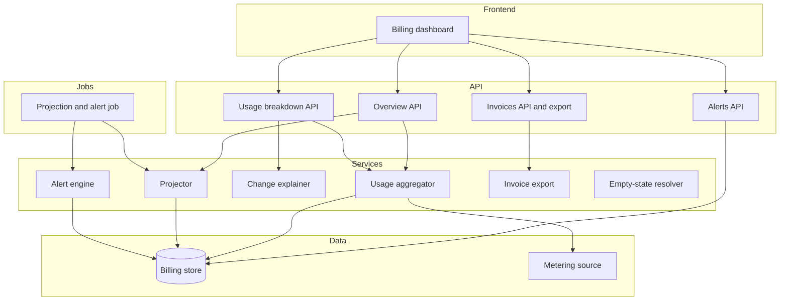
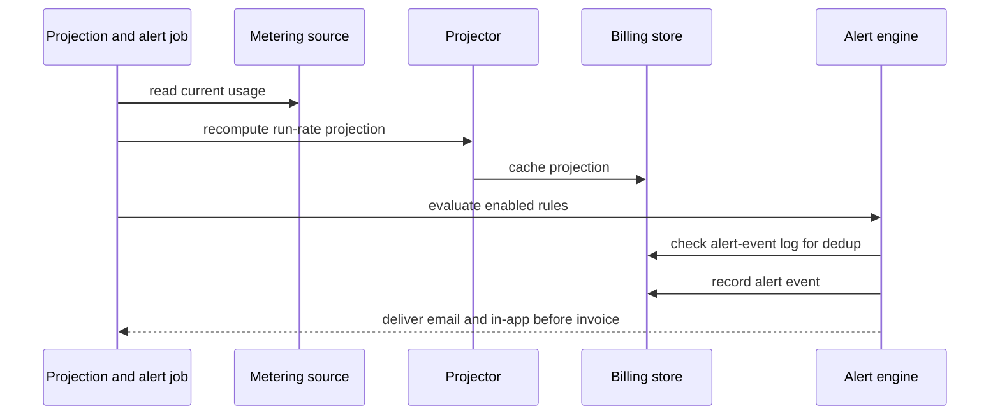
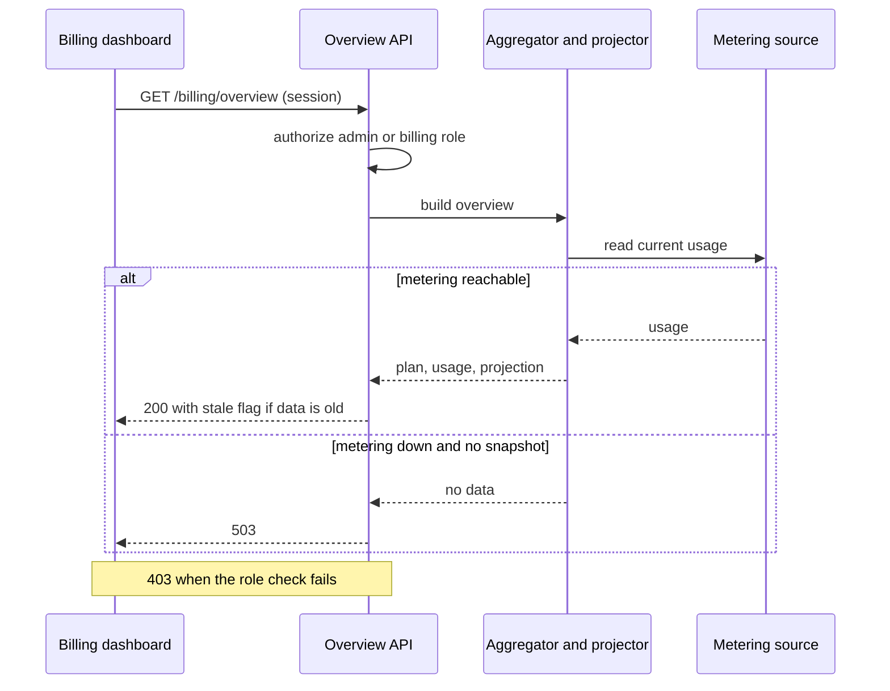

# Technical Design: Self-Serve Billing Usage Dashboard

**Feature**: Self-Serve Billing Usage Dashboard
**Created**: 2026-05-31
**Status**: Draft

## Summary

This adds a read-only billing dashboard that spans a frontend surface, four read endpoints plus an export, a set of domain services, a scheduled projection-and-alert job, and a durable billing store. Usage is read from an existing upstream metering source and is never owned here. The central design principle is a single aggregation pass that produces the account total and the per-team plus unattributed split together, so they always reconcile. A scheduled job recomputes the run-rate projection and delivers overage alerts before each invoice is issued.

**Current state**: Plans, teams, invoices, and metered usage already exist in upstream systems, and there is no self-serve billing view today.
**Affected layers**: frontend, API layer, domain services, background job, data layer.
**Constraints**:

- Read-only over billing; no plan changes, payments, or disputes.
- Usage is read from the metering source, never owned.
- Per-team plus unattributed usage must reconcile to the total.
- A threshold alert fires at most once per period.
- Alerts must be delivered before the invoice is issued.
- Every panel must render a purposeful empty state.
- Organization is resolved from the session, never a parameter.
- Amounts shown in the account's single labeled currency.

## Non-Functional Requirements

| Quality attribute (ISO 25010) | Target                                                          | How verified                                                |
| ----------------------------- | --------------------------------------------------------------- | ----------------------------------------------------------- |
| Performance efficiency        | Overview returns within 1 s p95                                 | Backend performance test                                    |
| Performance efficiency        | Usage-by-team within 1.5 s p95 for hundreds of teams            | Performance test with a large-org fixture                   |
| Functional suitability        | Per-team plus unattributed equals the account total exactly     | Reconciliation test suite                                   |
| Reliability                   | At least 90% of alerting overage accounts warned before invoice | Alert-before-close integration test plus production monitor |
| Interaction capability        | Projected bill graspable within 30 s of opening                 | Usability check                                             |
| Interaction capability        | Any invoice exported within 1 minute and 3 actions              | End-to-end export test                                      |
| Functional suitability        | 100% of panels render a purposeful empty state for new accounts | End-to-end empty-state tests                                |

## Architectural Approach

The feature is additive and read-oriented. The frontend is a single billing dashboard composed of panels for cost overview, usage by team, alerts, and invoices, each backed by a read endpoint. The backend exposes four read APIs (overview, usage breakdown with period comparison, alerts, invoices) plus an invoice export. None of these write into billing; the only write path is saving an alert rule.

The reconciliation core is a usage aggregator that performs one pass over the upstream metering source and the billing store, producing the account total and the per-team plus unattributed split at the same time. The result is materialized as a per-period usage aggregate so reads stay fast for large organizations and the reconciliation invariant holds by construction. The projector consumes the same usage to compute a run-rate end-of-period estimate, splitting the already-included plan price from projected overage, and caches it as a usage projection with a basis date and a confidence flag.

Alerts are handled by a scheduled projection-and-alert job, the only non-request component in the design. On each run it recomputes the projection, the alert engine evaluates each enabled rule against it, dedups against the durable alert-event log, and delivers email and in-app notifications before the period's invoice is issued. The dashboard's alerts panel only reads the rule and the recent activity log; it never delivers alerts itself.

The read path resolves the organization from the authenticated session and gates every endpoint to the admin or billing role. A shared empty-state resolver lets each endpoint return a purposeful empty state (no usage yet, no invoices yet, no team usage) so the dashboard never shows a blank or error panel. When the metering source is stale or unreachable, the overview returns a stale flag rather than implying a confident projection.

This structure was chosen over owning a new billing or usage model because plans, teams, invoices, and usage already exist upstream. Reading additively keeps the feature from introducing write paths into billing, narrows the blast radius, and leaves the existing invoice document in place for export. The trade-off is a dependence on upstream data quality and freshness, which the stale-data handling is designed to make visible.



## Affected Modules

| Module / Component           | Change | Responsibility                                               |
| ---------------------------- | ------ | ------------------------------------------------------------ |
| Billing dashboard (frontend) | adds   | Renders cost, breakdown, alerts, invoices, and empty states. |
| Overview API                 | adds   | Returns plan, usage versus allowance, and the projection.    |
| Usage breakdown API          | adds   | Returns per-team usage and period comparison with drivers.   |
| Alerts API                   | adds   | Reads alert rule and activity; saves rule changes.           |
| Invoices API and export      | adds   | Lists invoices, line-item detail, and structured export.     |
| Usage aggregator             | adds   | One pass to account total, per-team, and unattributed.       |
| Projector                    | adds   | Run-rate projection with included and overage split.         |
| Change explainer             | adds   | Period comparison and ranked change drivers.                 |
| Alert engine                 | adds   | Evaluates rules, dedups, and records alert events.           |
| Empty-state resolver         | adds   | Shared purposeful empty state for each panel.                |
| Projection and alert job     | adds   | Scheduled recompute and pre-invoice alert delivery.          |
| Metering source              | uses   | Upstream usage, read-only, with a freshness signal.          |
| Billing store                | adds   | Durable plans, invoices, rules, events, and projections.     |

## Data Design

### Data Model

```text
Organization (Account)  [referenced, upstream]
- org_id: id - scopes every billing query
- billing_currency: currency code - single currency, labels all amounts

Plan (Subscription)
- plan_name, cycle_start, cycle_end
- included_allowances: map dimension -> quantity
- overage_rates: map dimension -> money (absent => flat, no overage)
- effective_from: timestamp - supports mid-cycle change

Team  [referenced, upstream]
- team_id, team_name (retained for renamed or deleted teams), org_id

MeteredUsage  [upstream, read-only]
- org_id, team_id (null => unattributed), dimension, quantity, occurred_at

UsageAggregate  [materialized per period]
- org_id, period, team_id (null => unattributed), dimension, quantity, computed_at
- invariant: sum over teams + unattributed == account total per dimension

UsageProjection  [cached]
- projected_usage: map dimension -> quantity (run-rate)
- included_amount, projected_overage_amount, projected_total: money
- basis_as_of: timestamp; confidence: low | normal

Invoice
- invoice_id, org_id, period_start, period_end, issued_at
- total_amount: money; status: paid | pending | failed | refunded
- document_url: existing human-readable document

InvoiceLineItem
- invoice_id, description, dimension (nullable), quantity (nullable), amount

AlertRule
- rule_id, org_id, enabled
- threshold: projected_overage | percent_of_allowance (0..100]
- channels: email, in_app

AlertEvent  [durable log, dedup ledger]
- event_id, rule_id, org_id, period, threshold, sent_at, channels_sent
- unique (rule_id, period, threshold) => one alert per threshold per period
```

### Data Flow

On a dashboard read, the overview endpoint asks the projector for the cached projection and the aggregator for the current-period aggregate; the aggregator reads the upstream metering source and the billing store in one pass and materializes the per-team split. The only synchronous write into billing is saving an alert rule. The scheduled job is the only non-request writer of derived data: it recomputes the projection, the alert engine evaluates each enabled rule against it, dedups against the alert-event log, and delivers email and in-app alerts before the period's invoice is issued.



## API Design

All endpoints resolve the organization from the authenticated session and require the admin or billing role. Shapes below are conceptual, not a full specification.

```text
GET /billing/overview
  Request:  org from session (never a parameter)
  Response: currency, data_as_of, stale, plan,
            usage[dimension, consumed, allowance],
            projection{included_amount, projected_overage_amount,
                       projected_total, basis_as_of, confidence}
            empty_state "no_usage_yet" when there is no usage
  Errors:   401 unauthenticated; 403 not admin or billing;
            503 metering down and no snapshot exists

GET /billing/usage-by-team
  Request:  optional period (defaults to current)
  Response: account_total, teams[charges, share, by_dimension],
            unattributed bucket
            invariant: sum(teams) + unattributed == account_total
            empty_state "no_team_usage" when none
  Errors:   401; 403; 404 period before retained history

GET /billing/period-comparison
  Request:  period (defaults to current), compared to previous
  Response: current_total, previous_total, change_amount, change_pct,
            drivers[] ranked by absolute change_amount
  Errors:   401; 403; 404 period before retained history

GET /billing/alerts
  Response: rule{enabled, threshold, channels},
            recent_activity[] from the alert-event log

PUT /billing/alerts
  Request:  enabled, threshold{projected_overage |
            percent_of_allowance value 0..100}, channels
  Response: the saved rule
  Errors:   400 invalid threshold, percent, or empty channels; 401; 403
  Note:     delivery and dedup happen in the scheduled job, not here

GET /billing/invoices
  Response: invoices[invoice_id, period, issued_at, total_amount, status],
            next_cursor; empty_state "no_invoices_yet" for new accounts
  Errors:   401; 403

GET /billing/invoices/{invoice_id}
  Response: invoice header plus line_items[description, dimension,
            quantity, amount]
  Errors:   401; 403; 404 not found or not owned

GET /billing/invoices/export
  Request:  invoice_ids (optional, all if omitted), format (csv default)
  Response: structured file, one row per line item, amounts in account currency
  Errors:   400 unsupported format; 401; 403; 404 invoice not owned
```



## Spec Coverage

| Use Case (from spec.md)           | Component / Operation                            | Notes                                            |
| --------------------------------- | ------------------------------------------------ | ------------------------------------------------ |
| US1 current cost and projection   | GET /billing/overview; Projector                 | Included and overage shown as separate fields    |
| US1 flat plan, no overage         | GET /billing/overview; Projector                 | Projected overage is zero; no overage dimensions |
| US2 per-team breakdown            | GET /billing/usage-by-team; Usage aggregator     | Single-pass reconciliation (SC-006)              |
| US2 period comparison and drivers | GET /billing/period-comparison; Change explainer | Drivers ranked by absolute change                |
| US2 unattributed usage            | Usage aggregator; usage-by-team                  | Labeled bucket, never dropped                    |
| US3 alert fires and is recorded   | Projection and alert job; Alert engine           | Delivered before invoice (SC-003)                |
| US3 no duplicate alert            | Alert engine; AlertEvent unique key              | At most once per period (FR-014)                 |
| US3 alerts disabled               | PUT /billing/alerts; Alert engine                | enabled false suppresses delivery                |
| US4 invoice list                  | GET /billing/invoices                            | Reverse-chronological; status enum               |
| US4 line-item detail              | GET /billing/invoices/{invoice_id}               | Per-invoice line items                           |
| US4 export                        | GET /billing/invoices/export; Invoice export     | Structured file for finance                      |
| US5 empty usage state             | GET /billing/overview; Empty-state resolver      | empty_state no_usage_yet                         |
| US5 empty invoice state           | GET /billing/invoices; Empty-state resolver      | empty_state no_invoices_yet                      |
| US5 empty team-usage state        | GET /billing/usage-by-team; Empty-state resolver | empty_state no_team_usage                        |

## Key Technical Decisions

### Single-pass aggregation, materialized per period

**Context**: Per-team and unattributed usage must reconcile exactly to the account total, with fast reads for large organizations.
**Options considered**:

- Compute total and per-team separately on each read; risks drift.
- One aggregation pass, materialized per period; deterministic and fast.

**Decision**: One pass produces the total, per-team, and unattributed together, materialized as a per-period aggregate.
**Consequences**:

- Positive: reconciliation holds by construction; reads stay fast.
- Negative: adds a materialized snapshot to refresh and store.

### Scheduled projection-and-alert job, not compute-on-view

**Context**: Overage alerts must reach admins before the invoice is issued, even if they never open the dashboard.
**Options considered**:

- Evaluate alerts on each view; misses admins who never open.
- A scheduled job recomputes and fires before close.

**Decision**: A scheduled job recomputes the projection and delivers alerts ahead of billing close.
**Consequences**:

- Positive: alerts arrive even if the admin never visits.
- Negative: adds the only non-request component to operate.

### Read-only and additive over existing systems

**Context**: Plans, teams, invoices, and usage already exist in upstream systems.
**Options considered**:

- Own a new billing model; duplication and write paths.
- Read additively from existing systems and metering.

**Decision**: Add read endpoints, services, and a dashboard; never write into billing or own usage.
**Consequences**:

- Positive: no new write paths into billing; lower risk.
- Negative: depends on upstream data quality and freshness.

### Mid-cycle plan change priced against the effective plan

**Context**: A plan can change mid-period and the projection must not mix allowances.
**Options considered**:

- Apply the current plan to the whole period; misprices usage.
- Price usage against the plan effective when consumed.

**Decision**: Usage to date is priced against the plan effective at consumption; the remainder against the current plan.
**Consequences**:

- Positive: projection stays correct across a plan change.
- Negative: requires tracking plan effective dates within the cycle.

## Testing Strategy

- **Unit**: projection math, driver ranking, alert dedup, empty-state resolution.
- **Integration**: reconciliation, mid-cycle plan change, alert-before-close, role gating.
- **E2E / BDD**: overview, breakdown, export, and every empty state.
- **Observability**: alert delivery timing, projection freshness, reconciliation invariant checks.

## Rollout and Migration

**Strategy**: Gradual, role-gated enablement. Because the feature is additive and read-only, the dashboard can be turned on without touching existing billing flows.
**Data migration**: Add durable storage for plans, invoices, alert rules, alert events, and cached projections, and materialize per-period usage aggregates from the metering source. No migration of existing billing records is required.
**Rollback**: Disable the dashboard surface and the scheduled job. Since nothing writes into billing, removing the read surface leaves existing billing data untouched.

## Risks and Mitigations

**Upstream metering staleness or outage**

- **What could go wrong**: stale or missing usage yields wrong projections.
- **Probability**: Medium
- **Impact**: High
- **Mitigation**: return a stale flag or 503; never imply confidence.

**Inaccurate early-period projection**

- **What could go wrong**: early run-rate projections overstate cost, triggering false alarms.
- **Probability**: Medium
- **Impact**: Medium
- **Mitigation**: expose the basis date and a low-confidence flag early.

**Reconciliation drift**

- **What could go wrong**: per-team and unattributed fail to equal the total.
- **Probability**: Low
- **Impact**: High
- **Mitigation**: single-pass aggregation plus a reconciliation assertion in tests.

**Late or missed overage alerts**

- **What could go wrong**: alerts fire after the invoice, defeating the feature.
- **Probability**: Low
- **Impact**: High
- **Mitigation**: run the job before close; dedupe via the event key.
