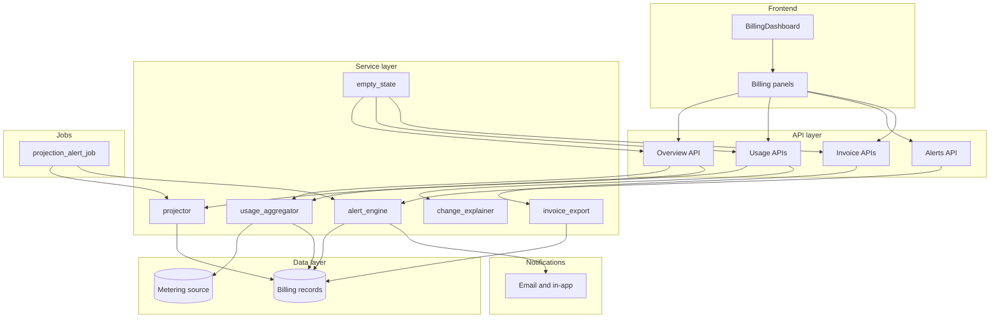
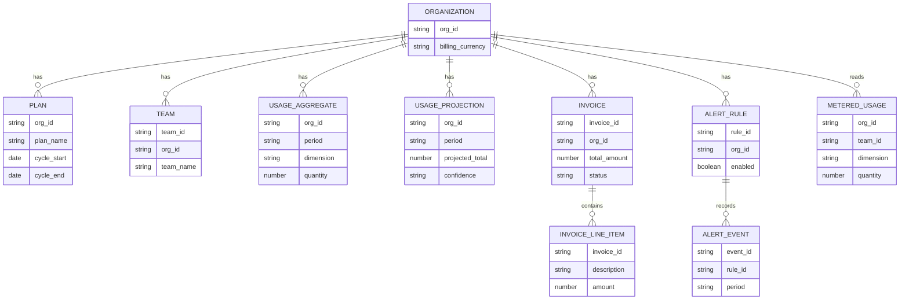
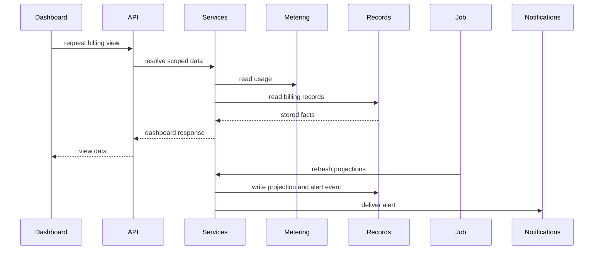
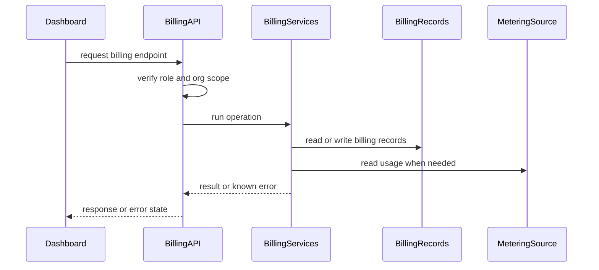
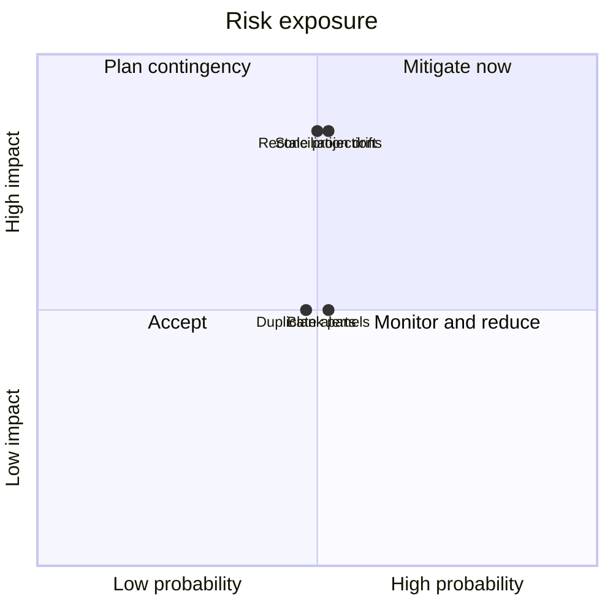

# Technical Design: Implementation Plan: Self-Serve Billing Usage Dashboard

**Feature**: Implementation Plan: Self-Serve Billing Usage Dashboard
**Created**: 2026-05-30
**Status**: Draft

## Summary

This feature adds a read-only billing dashboard for organization admins. It affects the frontend billing surface, API layer, service layer, background jobs, data layer, and notification integrations. The architecture centers on read APIs, one usage aggregation path, cached projections, and a scheduled alert job.

## Technical Context

**Current state**: Plans, teams, invoices, and metered usage already exist upstream.
**Affected layers**: frontend, API layer, service layer, data layer, background jobs, notifications
**Technical constraints**:

- Org scope comes from the authenticated session.
- Billing data is restricted to admins and billing roles.
- The dashboard cannot change plans, payments, or disputes.
- Metered usage remains owned by the upstream source.
- Team plus unattributed usage must reconcile exactly.
- Alerts dedupe by rule, period, and threshold.
- Stale projections must be visible to admins.
- All money uses the account billing currency.

## Non-Functional Requirements

| Quality attribute (ISO 25010) | Target                                                 | How verified          |
| ----------------------------- | ------------------------------------------------------ | --------------------- |
| Performance efficiency        | Overview p95 under 1 s                                 | API performance test  |
| Performance efficiency        | Team breakdown p95 under 1.5 s                         | API performance test  |
| Functional suitability        | Projected bill understood within 30 s                  | E2E usability check   |
| Reliability                   | 90% of enabled overage accounts alerted before invoice | Alert job audit       |
| Functional suitability        | 100% of new-account panels show empty states           | E2E empty-state suite |
| Functional suitability        | Per-team usage reconciles exactly                      | Reconciliation test   |
| Functional suitability        | Invoice export in under 1 minute and 3 actions         | E2E export test       |

## Architectural Approach

The dashboard adds a frontend page composed of cost overview, team usage, alerts, invoice history, and empty-state components. The page calls four read API surfaces plus an invoice export operation. It never sends billing mutation requests except alert-rule configuration, which changes notification preferences only.

The API layer resolves the organization from the authenticated session and gates access to admins or billing-role users. It exposes overview, usage breakdown, alert, invoice, and export operations. These operations delegate billing logic to services rather than reading upstream systems directly.

The service layer uses `usage_aggregator`, `projector`, `change_explainer`, `alert_engine`, `invoice_export`, and `empty_state`. The aggregator computes account totals, team rows, and the unattributed bucket in one pass. The projector uses run-rate logic and cached projection records so the dashboard can distinguish included plan price from projected overage.

The data layer stores plans, invoices, invoice line items, alert rules, alert events, usage aggregates, and cached projections. Metered usage stays read-only in the upstream metering source. Current-period aggregates are refreshed for fast reads, while closed periods provide stable comparison and invoice history.

The scheduled projection and alert job recomputes projections, checks enabled alert rules, writes alert events, and sends email plus in-app notifications. The alert-event uniqueness constraint prevents duplicate alerts for the same rule, period, and threshold. Freshness fields let the dashboard show stale data instead of overstating confidence.



## Affected Modules

| Module / Component     | Change | Responsibility                                             |
| ---------------------- | ------ | ---------------------------------------------------------- |
| `BillingDashboard`     | adds   | Composes all billing panels behind role gating.            |
| `CostOverviewPanel`    | adds   | Shows plan, usage, projection, and stale data states.      |
| `UsageByTeamPanel`     | adds   | Shows team usage, unattributed usage, and change drivers.  |
| `AlertsPanel`          | adds   | Manages alert rules and recent alert activity.             |
| `InvoiceHistoryPanel`  | adds   | Lists invoices, line items, and export action.             |
| `EmptyState`           | adds   | Presents purposeful empty states for missing billing data. |
| `billingClient`        | adds   | Calls billing read APIs and export operation.              |
| `overview` API         | adds   | Serves plan, usage, projection, and freshness data.        |
| `usage_breakdown` API  | adds   | Serves team breakdown and period comparison data.          |
| `alerts` API           | adds   | Serves alert rules and alert activity.                     |
| `invoices` API         | adds   | Serves invoice history, detail, and export.                |
| `usage_aggregator`     | adds   | Computes account and team usage together.                  |
| `projector`            | adds   | Computes projected usage and overage split.                |
| `change_explainer`     | adds   | Ranks period-over-period charge drivers.                   |
| `alert_engine`         | adds   | Evaluates alert thresholds and dedupes events.             |
| `invoice_export`       | adds   | Produces structured invoice exports.                       |
| `projection_alert_job` | adds   | Refreshes projections and sends alerts.                    |
| `metering_client`      | uses   | Reads upstream usage and freshness signals.                |

## Data Design

### Data Model

```text
Organization
- org_id: UUID or string, scopes billing queries.
- billing_currency: ISO 4217 code, labels all money.

Plan
- org_id: reference, account owner.
- plan_name: string, displayed on overview.
- cycle_start and cycle_end: date, billing period bounds.
- included_allowances: map, included units by dimension.
- overage_rates: map, price per extra unit.
- effective_from: timestamp, supports mid-cycle change.

Team
- team_id: UUID or string, usage attribution key.
- team_name: string, preserved for historical usage.
- org_id: reference, account owner.

MeteredUsage
- org_id: reference, account owner.
- team_id: reference or null, null means unattributed.
- dimension: string, metered dimension.
- quantity: number, consumed units.
- occurred_at: timestamp, billing-period assignment.

UsageAggregate
- org_id: reference, account owner.
- period: period key, covered billing period.
- team_id: reference or null, unattributed bucket.
- dimension: string, metered dimension.
- quantity: number, aggregated units.
- computed_at: timestamp, freshness marker.

UsageProjection
- org_id: reference, account owner.
- period: period key, current billing period.
- projected_usage: map, projected units by dimension.
- included_amount: money, included plan price.
- projected_overage_amount: money, projected extra charge.
- projected_total: money, included plus overage.
- basis_as_of: timestamp, projection basis.
- confidence: enum, low or normal.

Invoice
- invoice_id: UUID, invoice identity.
- org_id: reference, account owner.
- period_start and period_end: date, covered period.
- issued_at: timestamp, invoice issue date.
- total_amount: money, account currency.
- status: enum, paid, pending, failed, or refunded.
- document_url: URL or null, existing invoice document.

InvoiceLineItem
- invoice_id: reference, parent invoice.
- description: string, line description.
- dimension: string or null, billed dimension.
- quantity: number or null, billed units.
- amount: money, line amount.

AlertRule
- rule_id: UUID, rule identity.
- org_id: reference, account owner.
- enabled: boolean, delivery toggle.
- threshold: descriptor, overage or allowance percentage.
- channels: set, email and in-app.
- updated_at: timestamp, last change.

AlertEvent
- event_id: UUID, event identity.
- rule_id: reference, triggering rule.
- org_id: reference, account owner.
- period: period key, billing period.
- threshold: descriptor, crossed threshold.
- sent_at: timestamp, delivery time.
- channels_sent: set, delivered channels.
```



### Data Flow

Dashboard reads call API operations, which resolve organization scope and invoke services. Usage aggregation reads the metering source and writes period aggregates. The scheduled job refreshes projections, evaluates alert rules, writes alert events, and sends notifications.



## API Design

The API surface is read-oriented and scoped to the authenticated organization. Alert configuration is the only write operation, and it writes notification preferences rather than billing state. Shared errors include unauthenticated access, missing billing role, unsupported export format, unknown invoice identity, and unavailable metering without a usable snapshot.

```text
GET /billing/overview
  Request: authenticated session.
  Response: currency, data_as_of, stale, plan, usage, projection.
  Empty state: no_usage_yet.
  Errors: 401, 403, 503.

GET /billing/usage-by-team
  Request: authenticated session, optional period.
  Response: currency, period, account_total, teams, unattributed.
  Empty state: no_team_usage.
  Errors: 401, 403, 404.

GET /billing/period-comparison
  Request: authenticated session, optional period.
  Response: current total, previous total, change, ranked drivers.
  Errors: 401, 403, 404.

GET /billing/alerts
  Request: authenticated session.
  Response: alert rule and recent alert activity.
  Errors: 401, 403.

PUT /billing/alerts
  Request: enabled, threshold, channels.
  Response: saved alert rule.
  Errors: 400, 401, 403.

GET /billing/invoices
  Request: authenticated session, optional pagination.
  Response: currency, invoices, next cursor.
  Empty state: no_invoices_yet.
  Errors: 401, 403.

GET /billing/invoices/{invoice_id}
  Request: authenticated session, invoice identity.
  Response: invoice detail and line items.
  Errors: 401, 403, 404.

GET /billing/invoices/export
  Request: authenticated session, invoice identities, format.
  Response: structured invoice data.
  Errors: 400, 401, 403, 404.
```



## Spec Coverage

| Use Case (from spec.md)         | Component / Operation                              | Notes                                                          |
| ------------------------------- | -------------------------------------------------- | -------------------------------------------------------------- |
| US1 current cost and projection | `GET /billing/overview` and `CostOverviewPanel`    | Covers plan, allowance, projection, flat plan, and stale data. |
| US2 charge-change explanation   | `GET /billing/usage-by-team` and period comparison | Covers team rows, drivers, and unattributed reconciliation.    |
| US3 projected-overage alerts    | alerts API plus `projection_alert_job`             | Covers enable, disable, threshold crossing, and dedupe.        |
| US4 invoice history and export  | invoice APIs plus `InvoiceHistoryPanel`            | Covers list, detail, export, status, and retained history.     |
| US5 new-customer empty states   | `empty_state` plus dashboard panels                | Covers no usage, no invoices, and no team usage.               |
| Mid-period plan change          | `projector` and plan effective rows                | Covers usage and projection under changed plan terms.          |
| Large organization breakdown    | usage APIs and `UsageByTeamPanel`                  | Covers readable grouping and pagination expectations.          |
| Access revoked while open       | API role gating                                    | Covers refusal to show billing data after access loss.         |
| Delayed metering source         | overview API and freshness fields                  | Covers stale and unavailable usage presentation.               |

## Key Technical Decisions

### Read-oriented billing API and dashboard

**Context**: The feature must expose billing insight without taking over billing writes.
**Options considered**:

- Own billing flows: higher risk and broader scope.
- Add read views: smaller scope and clearer boundaries.
- Reuse support tooling: less customer-facing control.

**Decision**: Add read APIs, dashboard panels, and alert preference writes.
**Consequences**:

- Positive: Admins get self-service insight without billing-flow churn.
- Negative: Plan changes and payments still depend on existing flows.

### Single-pass usage aggregation

**Context**: Per-team, unattributed, and account totals must reconcile exactly.
**Options considered**:

- Separate queries: simpler but risks drift.
- Cached team totals: fast but harder to trust.
- One aggregation pass: consistent and testable.

**Decision**: Compute account total and team splits together.
**Consequences**:

- Positive: Reconciliation becomes a service-level invariant.
- Negative: Breakdown freshness depends on aggregation freshness.

### Scheduled projection and alert job

**Context**: Alerts must arrive before invoice issuance and avoid duplicates.
**Options considered**:

- Request-time alerts: misses inactive admins.
- Invoice-time alerts: too late for prevention.
- Scheduled job: proactive and auditable.

**Decision**: Run a projection and alert job before billing close.
**Consequences**:

- Positive: Alerts do not require dashboard visits.
- Negative: Job monitoring becomes part of feature correctness.

## Testing Strategy

- **Unit**: Projection math, driver ranking, alert dedupe.
- **Integration**: Reconciliation, plan changes, role gating, alerts.
- **E2E / BDD**: Overview, breakdown, alerts, invoices, empty states.
- **Observability**: Projection freshness, alert sends, export outcomes.

## Rollout and Migration

**Strategy**: Additive dashboard rollout behind billing-role access.
**Data migration**: Add durable records for plans, invoices, alerts, and projections.
**Rollback**: Not specified in source.

## Risks and Mitigations

**Reconciliation drift**

- **What could go wrong**: Team totals stop matching account totals.
- **Probability**: Medium
- **Impact**: High
- **Mitigation**: Aggregate account and team totals together.

**Duplicate alerts**

- **What could go wrong**: Admins receive repeated threshold notifications.
- **Probability**: Medium
- **Impact**: Medium
- **Mitigation**: Enforce unique alert events per threshold.

**Stale projections**

- **What could go wrong**: Admins trust outdated projected charges.
- **Probability**: Medium
- **Impact**: High
- **Mitigation**: Return freshness and stale-data flags.

**Blank new-account panels**

- **What could go wrong**: New admins see empty or broken panels.
- **Probability**: Medium
- **Impact**: Medium
- **Mitigation**: Drive empty states from API responses.


