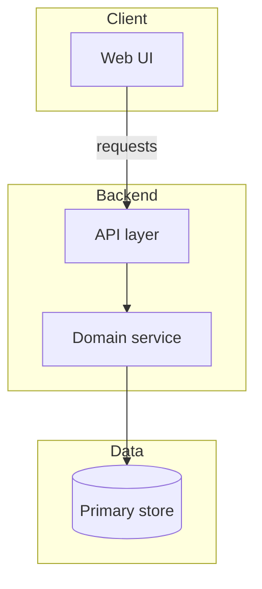
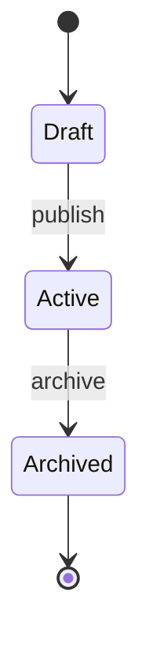
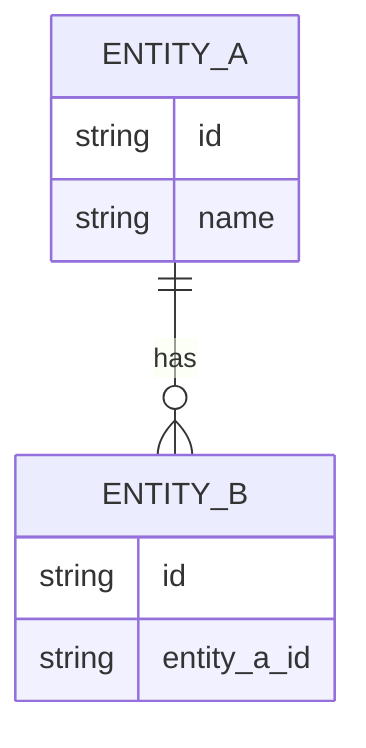
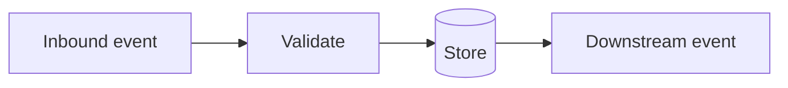
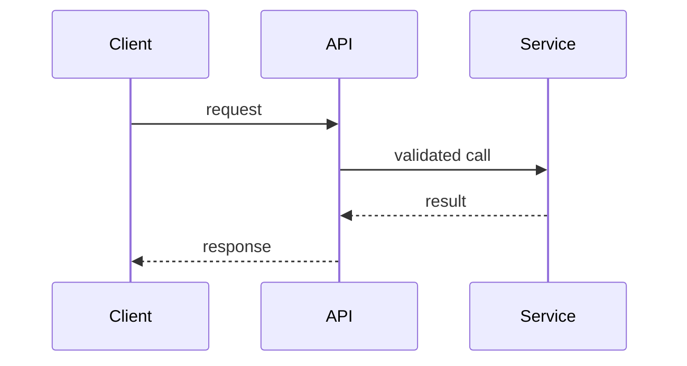

# Technical Design: [FEATURE NAME]

**Feature**: [FEATURE NAME]
**Created**: [DATE]
**Status**: Draft

## Summary

[2-4 sentences. What is being built technically, which system layers are affected, and the key architectural approach. Enough for a tech lead to understand scope at a glance.]

## Technical Context

**Current state**: [One sentence describing the relevant part of the system as it exists today.]
**Affected layers**: [Comma-separated list: e.g. frontend, API layer, data layer, background jobs, infra.]
**Technical constraints**:

- [Non-measurable design rule or boundary from plan.md or spec.md: e.g. backward compatibility requirement, approved library policy, a must-not behavior. Put measurable numeric targets in the Non-Functional Requirements table below, not here.]
- [Constraint 2]

## Non-Functional Requirements _(optional)_

> Include only when the source states measurable quality targets (latency, throughput, availability, accuracy, accessibility, and similar). Map each to an ISO 25010 quality category and a numeric target, plus how it is verified. State numbers, not adjectives ("p95 under 250 ms", not "fast"). This table is the single home for measurable numeric targets; do not also list them as bare Technical Constraints bullets. Omit the section entirely when the source names no measurable target, or when the table would only restate the Technical Constraints above without adding the ISO category and verification method.

| Quality attribute (ISO 25010)                                                                                                                                                          | Target                                     | How verified                                |
| -------------------------------------------------------------------------------------------------------------------------------------------------------------------------------------- | ------------------------------------------ | ------------------------------------------- |
| [One of the 8 ISO 25010 categories: Functional suitability / Performance efficiency / Compatibility / Interaction capability / Reliability / Security / Maintainability / Flexibility] | [Numeric target with units and conditions] | [Test, monitor, or review that confirms it] |

## Architectural Approach

[3-6 paragraphs. How the solution fits into the existing architecture. Which components are added, changed, or removed. How they connect and why this structure was chosen over alternatives. Reference component and module names. State the key design principles driving the approach. No code, no framework-specific syntax.]

> Diagram: a `flowchart` that shows how the components connect. Group layers (frontend, API, data, jobs) into `subgraph` blocks, C4 container/component level. Only include nodes and edges named in the prose above.



> State diagram (only when the source describes a lifecycle or state machine): a `stateDiagram-v2` for the entity or process whose states are named in the source. Omit otherwise.



## Affected Modules

| Module / Component | Change                           | Responsibility                                   |
| ------------------ | -------------------------------- | ------------------------------------------------ |
| [name]             | adds / modifies / removes / uses | [One sentence: what it does and why it changes.] |
| [name]             | adds / modifies / removes / uses | [One sentence.]                                  |

## Data Design _(optional)_

> Include only when `plan.md`, `spec.md`, or `data-model.md` contains data model information. Omit the entire section otherwise.

### Data Model

[List the key entities and their main fields at shape level. Sufficient for a reviewer to understand the data contract. No full ORM schema or migration DDL. Use plain text blocks.]

```text
[Entity name]
- [field]: [type] - [purpose or constraint]
- [field]: [type]
```

> Diagram: an `erDiagram` for the entities and relationships named above. Only include entities present in the source.



### Data Flow

[How data moves through the system: what triggers creation or mutation, where it persists, what events or messages are emitted downstream.]

> Diagram: a `flowchart` (or `sequenceDiagram` when ordering matters) tracing how data moves between the components named above.



## API Design _(optional)_

> Include only when the feature exposes or modifies any API surface. Omit the entire section otherwise.

[Describe endpoint or operation shapes at a conceptual level. Request and response shapes, key error cases, and important constraints. Not a full OpenAPI spec; enough for a tech lead to assess the surface area and spot design issues.]

```text
[METHOD] [/path]
  Request:  [key fields and types]
  Response: [key fields and types]
  Errors:   [HTTP status or error code]: [meaning]
```

> Diagram: a `sequenceDiagram` showing the request/response interaction between the caller and the services that handle it. Include the key error path when the source describes one.



## Spec Coverage _(optional)_

> Include only when `spec.md` contains use cases or Gherkin scenarios. Map each use case to the component or operation that implements it. Gaps must be flagged in the Notes column with "GAP".

| Use Case                                | Component / Operation        | Notes                               |
| --------------------------------------- | ---------------------------- | ----------------------------------- |
| [Gherkin scenario title or use case ID] | [component name or endpoint] | [key constraint, edge case, or gap] |

## Key Technical Decisions _(optional)_

> Include one subsection per significant decision. Omit the entire section when plan.md has no explicit design choices.

### [Decision title]

**Context**: [What constraint or trade-off forced a decision.]
**Options considered**:

- [Option A: brief pros and cons]
- [Option B: brief pros and cons]

**Decision**: [What was chosen and the primary reason.]
**Consequences**:

- Positive: [What this enables or simplifies.]
- Negative: [Trade-off, future debt, or lock-in introduced.]

## Testing Strategy

- **Unit**: [Modules, functions, or classes to cover. Focus on non-trivial logic.]
- **Integration**: [Cross-component or cross-service flows that must be verified end-to-end at the service level.]
- **E2E / BDD**: [Spec scenarios to automate as priority. Reference use case IDs when available.]
- **Observability**: [Key metrics, structured log events, or traces needed to validate correctness in production.]

## Rollout and Migration

**Strategy**: [Feature flag / dark launch / gradual rollout / big bang. State which and why.]
**Data migration**: [Steps required, reversibility, and risk level. Write "None" if no migration is needed.]
**Rollback**: [How to revert if something goes wrong after deployment.]

## Risks and Mitigations _(optional)_

> Include only when plan.md or spec.md contains concrete risk signals. Omit otherwise.

**[Risk title]**

- **What could go wrong**: [One sentence including consequence.]
- **Probability**: [Low / Medium / High]
- **Impact**: [Low / Medium / High]
- **Mitigation**: [What is in place or planned to reduce this risk.]

> Diagram: a `quadrantChart` plotting each risk above on probability (x) by impact (y). Map Low near 0.2, Medium near 0.5, High near 0.85 on each axis. When risks share a cell, give them a small offset so labels stay readable, never one large enough to imply a difference the prose does not state. Plot only risks named above; never invent one. Omit when there are fewer than two risks, or when every risk lands in the same cell (the plot would add nothing over the prose).

```mermaid
quadrantChart
    title Risk exposure
    x-axis Low probability --> High probability
    y-axis Low impact --> High impact
    quadrant-1 Mitigate now
    quadrant-2 Plan contingency
    quadrant-3 Accept
    quadrant-4 Monitor and reduce
    [Risk name]: [0.5, 0.85]
    [Risk name]: [0.2, 0.5]
```

## Open Questions _(optional)_

> Include only when unresolved technical decisions remain. Omit otherwise.

- [Technical open question, one sentence.]
