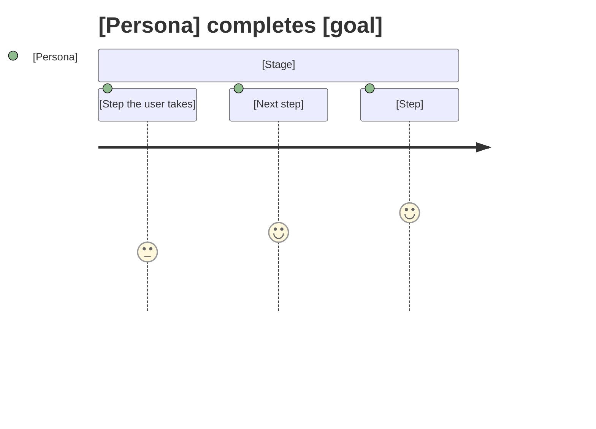
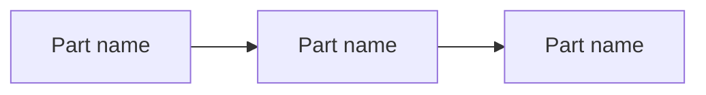
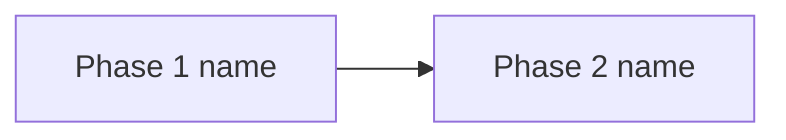

# Product Plan: [FEATURE NAME]

**Feature**: [FEATURE NAME]
**Created**: [DATE]
**Status**: Draft

## Summary

[One paragraph. What is being built, who it is for, and what the main approach is. No code. No file paths. No time estimates. Technical terms glossed on first use.]

## Feature Context

**Problem**: [What is broken or missing today, one sentence.]
**For**: [Who this serves - role or persona, not a user story.]
**Change**: [What is different for them after this ships, one sentence.]
**Quality bar**: [The observable standard this must meet - speed, reliability, coverage, or similar. No internal metrics.]
**Constraints**: [What this must not do or break. Omit if none.]

> User journey: a `journey` diagram of the steps the persona takes, drawn from the spec use cases. Plain-language step labels, no tooling or component names. Omit only when no user-facing flow is described in the source.



## Goals

- [Concrete outcome this feature delivers when complete, one sentence.]
- [Concrete outcome this feature delivers when complete, one sentence.]
- [Concrete outcome this feature delivers when complete, one sentence.]

## Out of Scope

- [Capability deliberately excluded, one short reason.]
- [Capability deliberately excluded, one short reason.]

## Build Overview _(optional)_

> Include only when the source plan contains architecture, component, or structural information. Omit the entire section otherwise.

[One paragraph. How the main parts of the system connect and why this structure was chosen. Plain language - no code, no file names, no framework names.]

- **[Part name]**: [What it does, one sentence. This feature [adds / changes / uses] it.]
- **[Part name]**: [What it does, one sentence. This feature [adds / changes / uses] it.]

> Diagram: a high-level `flowchart` showing how the parts above connect. Plain-language node labels only, no frameworks, languages, or file names. Omit only when the plan has no structural information.



## Key Principles _(optional)_

> Include only when the source plan articulates explicit guard rails, constraints, or core rules. Omit the entire section otherwise.

- **[Principle]**: [The rule and why it matters, one sentence.]
- **[Principle]**: [The rule and why it matters, one sentence.]

## Delivery Phases

> Roadmap: a `flowchart LR` of the phases below. One node per phase; draw an edge from each prerequisite phase to the phase that names it under "_Depends on_". Phases with no declared dependency are roots. Plain-language labels, no dates or durations. Render only when the dependencies branch (a phase has more than one direct dependent, or more than one phase has no prerequisite): a single straight chain or a set of independent phases adds nothing over the numbered list, so omit it then. Also omit when there are fewer than two phases.



### Phase 1: [Name]

- [What this phase delivers or enables, one sentence.]
- [What this phase delivers or enables, one sentence.]

### Phase 2: [Name]

_Depends on_: Phase 1.

- [What this phase delivers or enables, one sentence.]
- [What this phase delivers or enables, one sentence.]

## Key Decisions _(optional)_

> Include only when the source plan contains explicit design decisions. Omit the entire section otherwise.

### [Decision title]

**Context**: [What problem or constraint forced a choice, one sentence.]
**Options considered**: [The two or three alternatives that were on the table, brief sentence or list.]
**Decision**: [What was chosen, one sentence.]
**Consequence**: [What this enables and what it forecloses, one sentence.]

## Risks and Mitigations _(optional)_

> Include only when the source plan contains concrete risk signals. Omit otherwise.

**[Risk title]**

- **What could go wrong**: [Description and consequence, one sentence.]
- **Probability**: [Low / Medium / High]
- **Impact**: [Low / Medium / High]
- **Mitigation**: [What is in place to reduce the impact, one sentence.]

> Diagram: a `quadrantChart` plotting each risk above on probability (x) by impact (y). Map Low near 0.2, Medium near 0.5, High near 0.85 on each axis. When risks share a cell, give them a small offset so labels stay readable, never one large enough to imply a difference the prose does not state. Plot only risks named above; never invent one. Omit when there are fewer than two risks, or when every risk lands in the same cell (the plot would add nothing over the prose).

```mermaid
quadrantChart
    title Risk exposure
    x-axis Low probability --> High probability
    y-axis Low impact --> High impact
    quadrant-1 Mitigate now
    quadrant-2 Plan contingency
    quadrant-3 Accept
    quadrant-4 Monitor and reduce
    [Risk name]: [0.5, 0.85]
    [Risk name]: [0.2, 0.5]
```

## Divergences and Edge Cases _(optional)_

> Include only when the source plan describes scenarios that deviate from the normal flow. Omit otherwise.

- **[Scenario]**: [What the scenario is and how the system handles it, one to two sentences.]

## Validation _(optional)_

> Include only when the source plan defines explicit acceptance criteria. Omit otherwise.

- [Observable condition that confirms a part of the feature is correct, one sentence.]

## Open Questions _(optional)_

> Include only when the source plan contains open questions or marked assumptions. Omit otherwise.

- [Open question, one sentence.]
