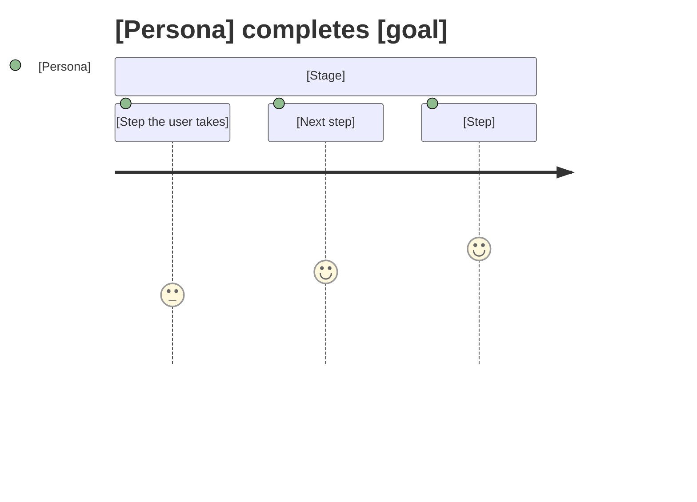
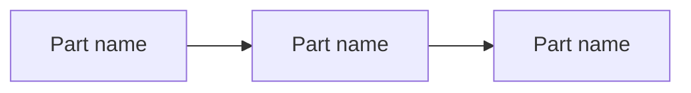
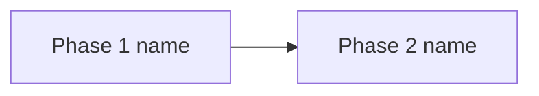

# Product Plan: [FEATURE NAME]

**Feature**: [FEATURE NAME]
**Created**: [DATE]
**Status**: Draft

> Authoring note (not emitted in the generated document): write every prose section to follow the humanization guide at `templates/humanization-guide.md` - plain English, varied cadence, no AI-tell phrases, no em dash.

## Summary

> One short paragraph (what is being built, who it is for, the main approach), then the context fields. No code, no file paths, no time estimates. Technical terms glossed on first use.

[One paragraph.]

**Problem**: [What is broken or missing today, one sentence.]
**For**: [Who this serves - role or persona.]
**Change**: [What is different for them after this ships, one sentence.]
**Quality bar**: [The observable standard this must meet - speed, reliability, coverage. No internal metrics.]
**Constraints**: [What this must not do or break. Omit if none.]

> User journey: a `journey` diagram of the steps the persona takes, drawn from the spec use cases. Plain-language labels, no tooling names. Omit when no user-facing flow is described.



## Goals and Non-Goals

> Two short lists. Goals are concrete outcomes when complete. Non-goals are deliberate exclusions with a one-phrase reason. Always populate non-goals; if it feels empty, look harder.

**Goals**:

- [Concrete outcome this feature delivers, one sentence.]
- [Concrete outcome this feature delivers, one sentence.]
- [Concrete outcome this feature delivers, one sentence.]

**Non-goals**:

- [Capability deliberately excluded, one short reason.]
- [Capability deliberately excluded, one short reason.]

## Build Overview _(optional)_

> Only when the source plan has architecture, component, or structural information. Omit otherwise.

[One paragraph. How the main parts connect and why this structure. Plain language, no code, file names, or framework names.]

- **[Part name]**: [What it does, one sentence. This feature adds / changes / uses it.]
- **[Part name]**: [What it does, one sentence. This feature adds / changes / uses it.]

> Diagram: a high-level `flowchart` of how the parts connect. Plain-language labels only. Omit when the plan has no structural information.



## Key Principles _(optional)_

> Only when the source plan states explicit guard rails or core rules. Omit otherwise.

- **[Principle]**: [The rule and why it matters, one sentence.]
- **[Principle]**: [The rule and why it matters, one sentence.]

## Delivery Phases

> Roadmap: a `flowchart LR` of the phases. One node per phase; an edge from each prerequisite to the phase that names it under "_Depends on_". Render only when dependencies branch; a single chain or independent phases adds nothing over the list. Omit with fewer than two phases. No dates or durations.



### Phase 1: [Name]

- [What this phase delivers or enables, one sentence.]
- [What this phase delivers or enables, one sentence.]

### Phase 2: [Name]

_Depends on_: Phase 1.

- [What this phase delivers or enables, one sentence.]
- [What this phase delivers or enables, one sentence.]

## Key Decisions _(optional)_

> Only when the source plan has explicit design decisions. Omit otherwise.

### [Decision title]

**Context**: [What forced a choice, one sentence.]
**Options considered**: [The two or three alternatives, brief.]
**Decision**: [What was chosen, one sentence.]
**Consequence**: [What this enables and forecloses, one sentence.]

## Risks and Mitigations _(optional)_

> Only when the source plan has concrete risk signals. Omit otherwise.

**[Risk title]**

- **What could go wrong**: [Description and consequence, one sentence.]
- **Probability**: [Low / Medium / High]
- **Impact**: [Low / Medium / High]
- **Mitigation**: [What reduces the impact, one sentence.]

> Diagram: a `quadrantChart` plotting each risk on probability (x) by impact (y). Map Low near 0.2, Medium near 0.5, High near 0.85. Offset shared cells just enough to keep labels readable. Plot only risks named above. Omit with fewer than two risks, or when every risk lands in the same cell.

```mermaid
quadrantChart
    title Risk exposure
    x-axis Low probability --> High probability
    y-axis Low impact --> High impact
    quadrant-1 Mitigate now
    quadrant-2 Plan contingency
    quadrant-3 Accept
    quadrant-4 Monitor and reduce
    [Risk name]: [0.5, 0.85]
    [Risk name]: [0.2, 0.5]
```

## Divergences and Edge Cases _(optional)_

> Only when the source plan describes scenarios that deviate from the normal flow. Omit otherwise.

- **[Scenario]**: [What it is and how the system handles it, one to two sentences.]

## Validation _(optional)_

> Only when the source plan defines explicit acceptance criteria. Omit otherwise.

- [Observable condition that confirms a part of the feature is correct, one sentence.]

## Open Questions _(optional)_

> Only when the source plan has open questions or marked assumptions. Omit otherwise.

- [Open question, one sentence.]
